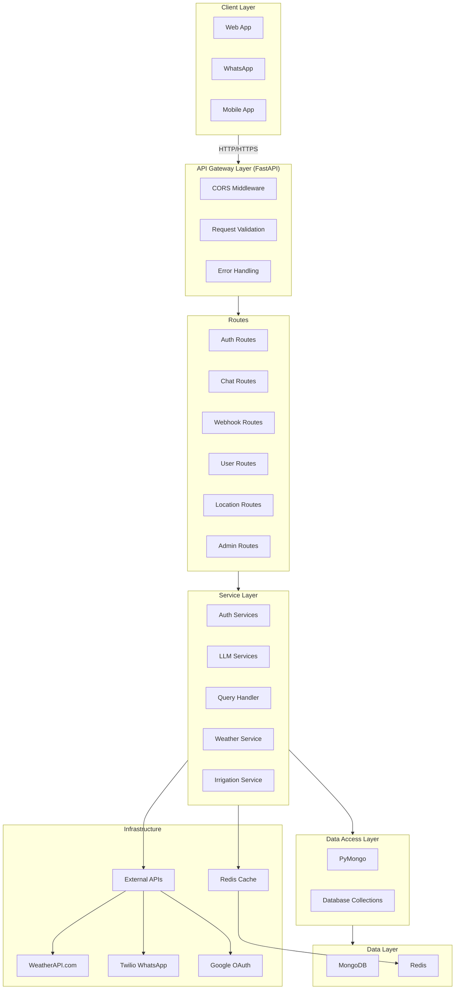
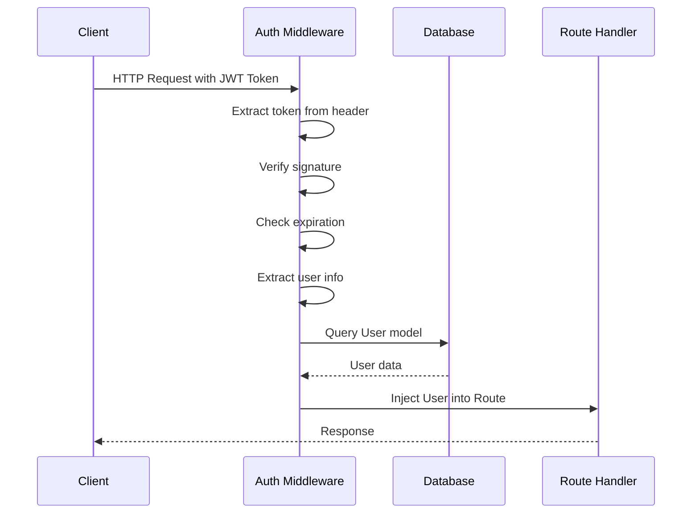
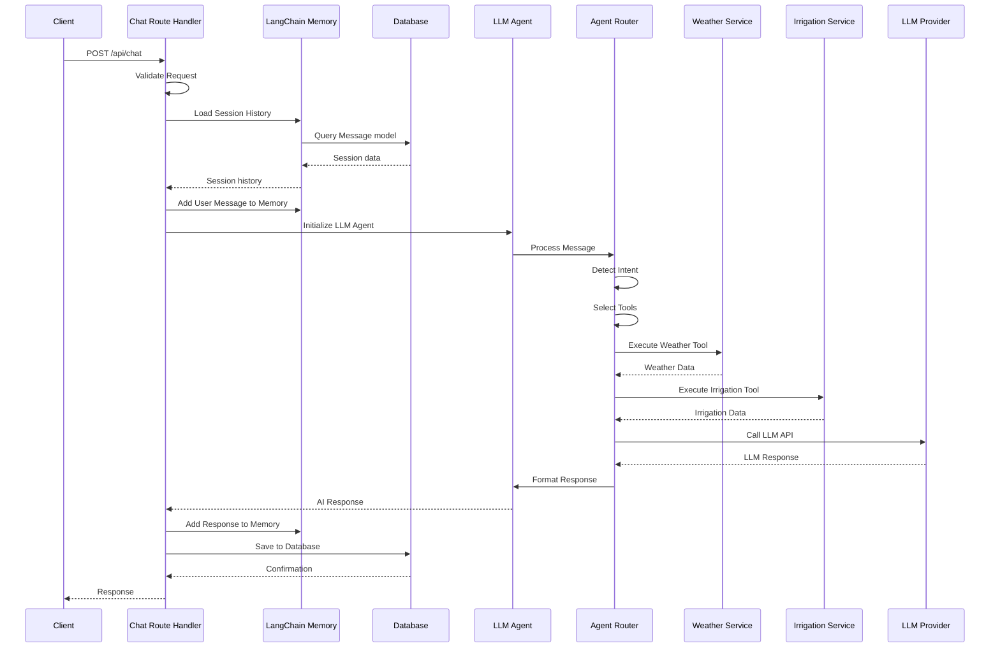
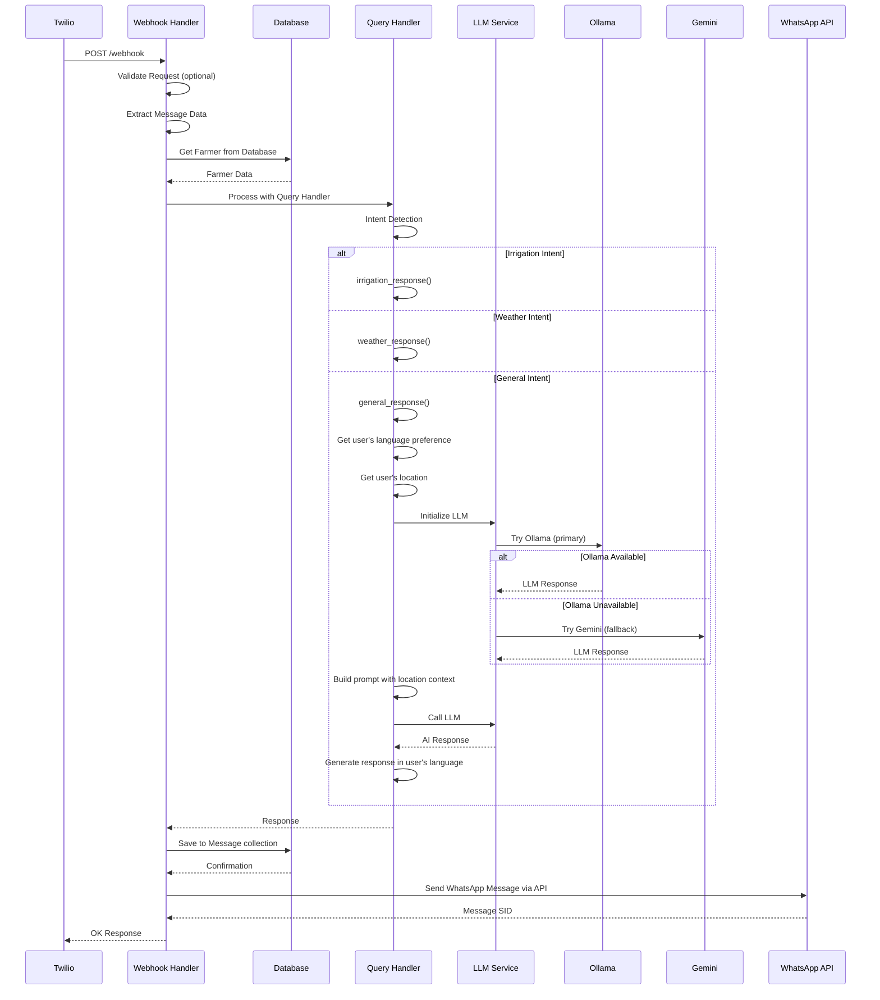

# Krashaq Backend Architecture Documentation

## System Architecture Overview

Krashaq Backend follows a layered architecture pattern with clear separation of concerns. The system is built on FastAPI and follows RESTful API principles.



## Architectural Patterns

### 1. Layered Architecture

The backend follows a strict layered architecture:

**Presentation Layer (Routes)**
- Handles HTTP requests/responses
- Request validation
- Response formatting
- Error handling

**Business Logic Layer (Services)**
- Contains core business logic
- Orchestrates data flow
- Integrates with external services
- No direct database access

**Data Access Layer (Models/DB)**
- Database operations
- PyMongo for MongoDB access
- Query execution
- Connection management

### 2. Dependency Injection

FastAPI's dependency injection is used throughout:

```python
# Database session injection
def endpoint(db: Session = Depends(get_db)):
    pass

# Authentication injection
def protected_route(current_user: User = Depends(get_current_user)):
    pass

# Configuration injection
settings = get_settings()
```

### 3. Repository Pattern (Partial)

Database operations are abstracted through PyMongo:
- Collections define schema
- Connection management
- Queries built through MongoDB query language

### 4. Service Pattern

Business logic is encapsulated in service classes:
- `LLMAgent` - AI processing
- `WeatherService` - Weather data
- `AuthService` - Authentication
- Each service is self-contained

### 5. Strategy Pattern

Multiple LLM providers supported through strategy pattern:
- `LLMProvider` - Abstract interface
- Concrete implementations for each provider
- Runtime provider selection

## Component Architecture

### 1. Application Entry Point (`main.py`)

**Responsibilities**:
- Initialize FastAPI application
- Configure middleware
- Register routers
- Create database tables
- Health check endpoint

**Dependencies**:
- Database engine
- All route modules
- Configuration

### 2. Configuration Module (`config.py`)

**Pattern**: Singleton with caching

**Responsibilities**:
- Load environment variables
- Provide type-safe configuration
- Cache configuration values
- Centralized settings management

**Design Decisions**:
- Uses `lru_cache` for singleton pattern
- Environment-based configuration
- Default values for development

### 3. Database Module (`db/`)

**Pattern**: Factory pattern for connections

**Responsibilities**:
- Create MongoDB connection
- Manage connection lifecycle
- Provide dependency injection
- Handle connection pooling

**Design Decisions**:
- MongoDB for all environments
- Connection pooling
- Automatic reconnection
- Database: krashaq

### 4. Models Module (`db/`)

**Pattern**: Collection-based schema (MongoDB)

**Responsibilities**:
- Define database schema
- Map collections to Python classes
- Define relationships
- Provide PyMongo interface

**Collections**:
- `users` - Web application users and farmers
- `messages` - Chat history from WhatsApp and web
- `refresh_tokens` - JWT refresh tokens
- `audit_logs` - System audit logs

### 5. Routes Module

**Pattern**: Router pattern

**Responsibilities**:
- Define API endpoints
- Handle HTTP methods
- Validate requests
- Return responses
- Error handling

**Route Categories**:
- Authentication (`/api/auth/*`)
- Chat (`/api/chat`, `/api/weather`)
- User management (`/api/farmers`)
- Locations (`/api/locations/*`)
- WhatsApp (`/webhook`)

### 6. Services Module

**Pattern**: Service layer pattern

**Responsibilities**:
- Business logic implementation
- External API integration
- Data processing
- Orchestration

**Service Categories**:

**Authentication Services**:
- `jwt_service.py` - Token management
- `google_oauth.py` - OAuth integration
- `two_factor.py` - 2FA logic

**LLM Services**:
- `llm_provider.py` - Multi-provider LLM factory (Ollama, Gemini, OpenAI, Claude, Grok)
- `llm_agent.py` - AI orchestration
- `agent_router.py` - LangGraph agent routing
- `langchain_memory.py` - Conversation memory
- `memory.py` - Session management
- `prompts.py` - Prompt templates

**Query Handler Services**:
- `query_handler.py` - Intent detection and routing for WhatsApp
- `whatsapp_sender.py` - WhatsApp message sender
- `irrigation_decision.py` - Rule-based irrigation logic

**Domain Services**:
- `weather.py` - Weather data (WeatherAPI.com)
- `irrigation.py` - Irrigation advice
- `fertilizer.py` - Fertilizer recommendations

**Infrastructure Services**:
- `cache/redis_service.py` - Caching
- `config_service.py` - System configuration management

### 7. Middleware Module

**Pattern**: Middleware chain

**Responsibilities**:
- Request interception
- Authentication
- Authorization
- Logging (future)

**Current Middleware**:
- CORS (built-in FastAPI)
- Auth middleware (custom)

## Data Flow Architecture

### Authentication Flow



### Chat Request Flow



### WhatsApp Webhook Flow



## Security Architecture

### Authentication

**JWT-Based Authentication**:
- Access tokens (short-lived: 30 minutes)
- Refresh tokens (long-lived: 7 days)
- Token rotation on refresh
- Revocation support

**OAuth 2.0 Integration**:
- Google OAuth flow
- Authorization code exchange
- Token management
- User profile retrieval

**2FA (Partial)**:
- TOTP-based (planned)
- SMS-based (planned)
- Backup codes (planned)

### Authorization

**Role-Based Access Control**:
- Roles: admin, farmer, viewer
- Route-level protection
- Middleware-based enforcement

### Security Measures

**Current**:
- Password hashing with bcrypt
- JWT token validation
- CORS configuration
- SQL injection prevention (ORM)

**Planned**:
- Rate limiting
- Request signing
- CSRF protection
- Security headers
- Input sanitization

## Scalability Architecture

### Current State

**Database**:
- SQLite for development
- Single instance
- No replication

**Caching**:
- Redis integration (partial)
- Response caching (planned)

**LLM**:
- Single provider at a time
- No load balancing
- No fallback mechanism

### Scalability Considerations

**Database**:
- Migrate to PostgreSQL
- Connection pooling
- Read replicas
- Database indexing

**Caching**:
- Redis cluster
- Cache warming
- Cache invalidation strategy
- Distributed caching

**LLM**:
- Provider fallback
- Load balancing
- Request queuing
- Response caching

**API**:
- Horizontal scaling
- Load balancer
- API gateway
- Rate limiting

## Integration Architecture

### External Integrations

**Weather API (WeatherAPI.com)**:
- REST API
- API key authentication
- Location-based queries
- Redis caching support

**Twilio WhatsApp**:
- Webhook-based
- Signature validation
- Two-way AI-powered messaging
- API-based message sending

**Google OAuth**:
- OAuth 2.0 flow
- JWT tokens
- User profile API
- Token refresh

**LLM Providers**:
- Ollama (primary) - Local LLM via HTTP
- Gemini (fallback) - Google Cloud LLM
- OpenAI (optional) - OpenAI API
- Claude (optional) - Anthropic API
- Grok (optional) - X.AI API
- Multi-provider fallback mechanism

### Internal Integrations

**Frontend Integration**:
- REST API
- JWT authentication
- CORS enabled
- JSON responses

**WhatsApp Integration**:
- Webhook endpoint
- Message processing
- Response generation
- Database logging

## Error Handling Architecture

### Error Types

**HTTP Exceptions**:
- 400 - Bad Request
- 401 - Unauthorized
- 403 - Forbidden
- 404 - Not Found
- 500 - Internal Server Error

### Error Handling Strategy

**Route Level**:
- Try-catch blocks
- Validation errors
- Business logic errors

**Service Level**:
- Graceful degradation
- Fallback responses
- Error logging

**Global Level**:
- Exception handlers (planned)
- Error logging
- User-friendly messages

## Logging Architecture

### Current State
- Console logging
- Basic error messages
- No structured logging

### Planned Improvements
- Structured logging
- Log levels (DEBUG, INFO, WARNING, ERROR)
- Log aggregation
- Request tracing
- Performance logging

## Testing Architecture

### Test Types

**Unit Tests**:
- Service layer testing
- Utility function testing
- Model validation testing

**Integration Tests**:
- Route testing
- Database operations
- External API mocking

**End-to-End Tests**:
- Complete workflows
- Authentication flows
- Chat interactions

### Testing Tools
- pytest
- pytest-asyncio
- httpx (for testing FastAPI)
- factory_boy (for test data)

## Deployment Architecture

### Development Environment
- SQLite database
- Local file storage
- Debug mode enabled
- Hot reload

### Production Environment (Planned)
- PostgreSQL database
- Redis cache
- Cloud deployment (AWS/GCP)
- Load balancer
- CDN for static assets
- Monitoring and alerting

### Deployment Strategy
- Containerization (Docker)
- CI/CD pipeline
- Blue-green deployment
- Database migrations
- Configuration management

## Performance Architecture

### Current Optimizations
- Connection pooling (SQLAlchemy)
- Lazy loading
- Async support (partial)

### Planned Optimizations
- Response caching
- Database query optimization
- Indexing strategy
- Async I/O throughout
- Compression

## Monitoring Architecture

### Current State
- Basic health check endpoint
- Console logs

### Planned Monitoring
- Application metrics
- Performance monitoring
- Error tracking
- Uptime monitoring
- Log aggregation
- Alerting

## Technology Rationale

### FastAPI
- Modern Python framework
- Automatic API documentation
- Type hints support
- Async support
- High performance

### PyMongo
- Official MongoDB driver
- Async support
- Connection pooling
- Simple API

### MongoDB
- NoSQL database
- Flexible schema
- Horizontal scaling
- Document-based storage

### Redis
- Fast in-memory cache
- Session storage
- Response caching
- Pub/Sub support

### LangChain
- LLM orchestration
- Memory management
- Tool integration
- Prompt management

## Future Architectural Improvements

### Short Term
- Complete 2FA implementation
- Add comprehensive error handling
- Implement structured logging
- Add rate limiting
- Improve caching strategy

### Medium Term
- Implement API gateway
- Add monitoring
- Improve testing coverage
- Implement CI/CD
- Add Redis cluster for distributed caching

### Long Term
- Microservices architecture
- Event-driven architecture
- GraphQL API
- Real-time features (WebSockets)
- Advanced analytics
- RAG implementation with vector database

## Documentation Standards

### Code Documentation
- Docstrings for all functions
- Type hints for all parameters
- Inline comments for complex logic
- Architecture decision records (ADRs)

### API Documentation
- OpenAPI/Swagger (automatic)
- Endpoint descriptions
- Request/response examples
- Error codes documentation

### Architecture Documentation
- System diagrams
- Component descriptions
- Data flow diagrams
- Deployment guides
