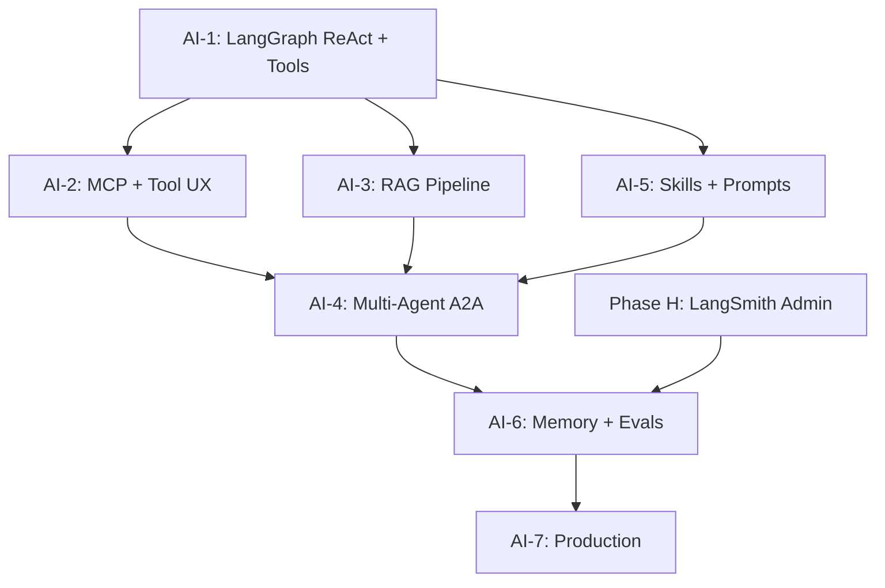

# Krashaq Agentic AI & RAG Master Plan — Claude/GPT-Class Architecture

> Version 1.0 · Aug 2026  
> Author lens: agentic workflows, MCP/A2A protocols, LangGraph, prompt engineering, skill management  
> Stack target: Next.js 16 monolith · LangGraph.js · MCP · MongoDB · Vector DB · LangSmith  
> Research basis: IBM ACP→A2A merge (Aug 2025), Anthropic MCP+Skills, LangGraph production patterns (2026)

---

## 0. Executive summary

**Today:** Krashaq frontend chat is a **single-pass LLM call** with regex-triggered weather/irrigation pre-fetch. No tool calling, no agent loop, no RAG, no MCP. The **full agent stack lives in Python** (`backend/app/conversation/services/agent_router.py` — LangGraph ReAct, fertilizer tools, orchestrator/synthesis agents, Pinecone RAG) but is **not ported** to the Next.js monolith.

**Target:** A **Claude/GPT-class agentic stack** where:
- The LLM **chooses tools** (not regex)
- Multi-step **ReAct loops** with reflection and fallbacks
- **RAG** over vetted agritech knowledge (schemes, crops, pests, local advisories)
- **MCP** exposes tools/data; **Skills** encode farming workflows
- **A2A-style** internal agents (router → specialist → synthesizer) under one orchestrator
- **Streaming** shows tool calls, reasoning steps, and citations like ChatGPT

**Recommended stack (2026 industry consensus):**

| Layer | Standard / framework | Role |
|-------|---------------------|------|
| Agent → Tools | **MCP** (Model Context Protocol) | USB-C for tools & data — Anthropic, OpenAI, Cursor all support |
| Agent → Agent | **A2A** (Agent2Agent, Linux Foundation) | ACP merged into A2A Aug 2025 — use A2A for multi-agent handoffs |
| Orchestration | **LangGraph.js** | Stateful graphs, checkpoints, human-in-the-loop |
| Observability | **LangSmith** | Traces, evals, cost — already planned in Phase H |
| Skills | **SKILL.md** folders (Anthropic open standard) | Progressive disclosure — farming playbooks |
| RAG | Hybrid retrieval (vector + BM25) + reranker | Domain KB for Indian agriculture |

> **Note on ACP:** IBM’s Agent Communication Protocol is **deprecated as a standalone standard** — merged into [A2A under Linux Foundation](https://lfaidata.foundation/communityblog/2025/08/29/acp-joins-forces-with-a2a-under-the-linux-foundations-lf-ai-data/) (Aug 2025). New Krashaq work should implement **MCP for tools** + **A2A patterns for agent-to-agent** messaging, not legacy ACP REST endpoints.

---

## 1. Current state audit

### 1.1 Frontend monolith (Next.js)

| Component | Status | Gap |
|-----------|--------|-----|
| `lib/server/services/chat.ts` | Single-pass invoke/stream | No ReAct loop |
| Tool use | Regex → `getWeather()` | Not LLM tool calling |
| `detectCrop()` | Metadata only | Not fed to tools or RAG |
| LangChain deps | Installed, barely used | No LangGraph, no `@langchain/mcp-adapters` |
| RAG | None | No embeddings, no vector store |
| SSE events | `session`, `meta`, `token`, `done` | No `tool_start`, `tool_result`, `citation` |
| User-scoped chat | ✅ Done (Chat phases) | — |
| LangSmith metadata | Partial (Chat-5) | No tool/run hierarchy |

### 1.2 Python backend (reference implementation)

| Component | Path | Port priority |
|-----------|------|---------------|
| LangGraph ReAct agent | `backend/.../agent_router.py` | **P0** |
| Orchestrator + Synthesis | `orchestrator_agent.py`, `synthesis_agent.py` | **P1** |
| Tools: weather, irrigation, fertilizer, crop | `@tool` decorators + cache | **P0** |
| Pinecone RAG | `backend/app/common/db/pinecone_client.py` | **P1** |
| Prompts / language / crop | `prompts.py` | **P0** |
| Metrics / quality scoring | `metrics.py` | **P2** |

### 1.3 Claude / ChatGPT patterns to match

| Pattern | Claude | ChatGPT | Krashaq target |
|---------|--------|---------|----------------|
| Tool calling | MCP servers + native tools | Plugins / Actions | MCP tools + native LangChain tools |
| Skills / instructions | Agent Skills (`SKILL.md`) | Custom GPTs / instructions | Krashaq Skills per domain |
| Multi-agent | Subagents + Skills | Orchestrator routing | LangGraph supervisor node |
| RAG | Project knowledge + MCP resources | File search / retrieval | Hybrid RAG + citations in UI |
| Streaming UX | Tool use visible in UI | Chain-of-thought (where enabled) | SSE tool events + markdown |
| Memory | Session + optional long-term | Thread memory | Mongo chat + user profile context |
| Eval / safety | Constitutional + tracing | Moderation API | LangSmith evals + agritech guardrails |

---

## 2. Target architecture

```
┌─────────────────────────────────────────────────────────────────────────┐
│                         CLIENT (KrashaqChat)                            │
│  Composer · Model pill · Tool call chips · Citations · Regenerate       │
└───────────────────────────────────┬─────────────────────────────────────┘
                                    │ SSE (extended events)
                                    ▼
┌─────────────────────────────────────────────────────────────────────────┐
│                    POST /api/chat/stream (auth + user_id)               │
│                    lib/server/agents/graph.ts (LangGraph)               │
└───────────────────────────────────┬─────────────────────────────────────┘
                                    │
          ┌─────────────────────────┼─────────────────────────┐
          ▼                         ▼                         ▼
   ┌─────────────┐          ┌─────────────┐          ┌─────────────┐
   │  ROUTER     │          │  REACT      │          │  RAG        │
   │  NODE       │─────────►│  AGENT      │◄─────────│  RETRIEVER  │
   │ (classify)  │          │  (tools)    │          │  NODE       │
   └─────────────┘          └──────┬──────┘          └─────────────┘
                                   │
                    ┌──────────────┼──────────────┐
                    ▼              ▼              ▼
             ┌──────────┐  ┌──────────┐  ┌──────────┐
             │ MCP      │  │ Native   │  │ Specialist│
             │ Server   │  │ Tools    │  │ Subagents │
             │ /api/mcp │  │ (TS)     │  │ (A2A)     │
             └──────────┘  └──────────┘  └──────────┘
                    │              │              │
                    └──────────────┴──────────────┘
                                   ▼
                    Weather · Irrigation · Fertilizer · Crop DB
                    MongoDB · Redis · Vector DB (Pinecone/pgvector)
```

### 2.1 Protocol layering (MCP + A2A + Skills)

```
┌────────────────────────────────────────────────────────────┐
│  SKILLS (HOW) — .cursor/skills or lib/skills/krashaq/    │
│  crop-advisory · pest-management · scheme-eligibility      │
│  Loaded progressively when router matches intent           │
├────────────────────────────────────────────────────────────┤
│  MCP (WHAT) — app/api/mcp/route.ts                         │
│  Tools: get_weather, get_irrigation, search_kb, ...        │
│  Resources: user location, farmer profile, session context │
├────────────────────────────────────────────────────────────┤
│  A2A-style internal messaging (agent handoffs)             │
│  RouterAgent → WeatherAgent | RAGAgent | GeneralAgent    │
│  Structured handoff payload (not free-text only)           │
└────────────────────────────────────────────────────────────┘
```

**Design rule (Anthropic):** MCP handles connectivity; Skills handle workflow logic. Never duplicate — MCP says *how to call the API*; Skill says *when, in what order, and how to present results*.

---

## 3. Phase overview

| Phase | Name | Duration | Outcome |
|-------|------|----------|---------|
| **AI-1** | LangGraph ReAct + native tools | 2 weeks | LLM chooses tools; multi-step loop |
| **AI-2** | MCP server + tool streaming UX | 1–2 weeks | Standard tool protocol; visible tool calls |
| **AI-3** | RAG pipeline (hybrid retrieval) | 2 weeks | Citations from vetted agritech KB |
| **AI-4** | Multi-agent orchestration (A2A patterns) | 2 weeks | Router + specialists + synthesis |
| **AI-5** | Skills system + prompt registry | 1 week | Domain playbooks, versioned prompts |
| **AI-6** | Memory, evals, guardrails | 1–2 weeks | Long-term memory, LangSmith evals |
| **AI-7** | Production hardening | 1 week | Rate limits, cost caps, fallbacks |

**Depends on:** Chat phases (user-scoped sessions ✅), Platform Phase H (LangSmith admin UI).

**Parallel track:** AI-1 + AI-2 can overlap; AI-3 needs embedding pipeline; AI-4 needs AI-1.

---

## 4. Phase AI-1 — LangGraph ReAct + native tools

**Goal:** Replace regex routing with LLM tool calling in a bounded ReAct loop (port from Python `agent_router.py`).

### AI-1.1 Dependencies

```bash
npm install @langchain/langgraph @langchain/langgraph-checkpoint-mongodb
# optional: zod-to-json-schema for tool schemas
```

### AI-1.2 Tool definitions (`lib/server/agents/tools/`)

| Tool | Source | Description |
|------|--------|-------------|
| `fetch_weather` | Port `weather.ts` | Current weather for location |
| `fetch_irrigation_advice` | Port + extend `irrigation.ts` | Watering advice given weather + crop |
| `fetch_fertilizer_advice` | Port from Python `fertilizer.py` | NPK / stage-based recommendations |
| `analyze_crop_needs` | Port from Python | Crop-specific guidance |
| `search_conversation` | `chat-memory.ts` | Search user's past chats (scoped) |
| `web_search` | **Tavily API** | Schemes, MSP, latest advisories, market news |
| `get_farmer_context` | User profile + RBAC | Location, role, linked supplier |

Use LangChain `tool()` with Zod schemas — **structured descriptions** for the model.

### AI-1.3 LangGraph state

```typescript
interface KrashaqAgentState {
  messages: BaseMessage[];
  session_id: string;
  user_id: string;
  user_role: string;
  location: string;
  language: string;
  detected_crop: string | null;
  tools_used: string[];
  iteration: number;
  rag_citations: Citation[];  // AI-3
}
```

**Graph nodes:**
1. `prepare` — inject system prompt + user context + optional skill snippet
2. `agent` — LLM with `bindTools(tools)`
3. `tools` — ToolNode executes selected tools
4. `should_continue` — max 5 iterations OR no tool calls → END
5. `finalize` — persist to Mongo, emit done event

### AI-1.4 Adaptive routing (GPT-style)

Before full ReAct, add lightweight **intent classifier** (cheap model or rules):

| Route | When | Path |
|-------|------|------|
| `fast` | Greeting, simple FAQ | Single LLM call, no tools |
| `tools` | Weather, irrigation, crop | ReAct loop |
| `rag` | Scheme, pest, policy questions | RAG node → synthesize (AI-3) |
| `complex` | Multi-intent message | Full orchestrator (AI-4) |

**Why:** Agentic-always loops add 3–10× latency; Claude/GPT route simple queries fast.

### AI-1.5 Files

```
lib/server/agents/
├── graph.ts              # LangGraph StateGraph
├── state.ts              # Typed state + reducers
├── nodes/
│   ├── prepare.ts
│   ├── agent.ts
│   ├── tools.ts
│   └── route.ts          # intent classifier
├── tools/
│   ├── weather.tool.ts
│   ├── irrigation.tool.ts
│   └── fertilizer.tool.ts
└── prompts/
    ├── system.base.ts    # Krashaq persona
    └── tool-guidance.ts  # When to use each tool
```

### AI-1.6 Acceptance criteria

- [ ] “What’s the weather in Bhopal?” triggers `fetch_weather` via LLM choice (not regex)
- [ ] Compound query: “Weather and irrigation for wheat” uses 2+ tools in one turn
- [ ] Max iteration guard prevents infinite loops
- [ ] `tools_used` persisted and visible in message metadata
- [ ] Fallback chain still works if primary provider fails mid-loop

---

## 5. Phase AI-2 — MCP server + streaming tool UX

**Goal:** Expose Krashaq tools via **MCP** so external clients (Cursor, Claude Desktop, future mobile) can use the same capabilities; upgrade SSE for ChatGPT-like tool visibility.

### AI-2.1 MCP server route

**Path:** `app/api/mcp/route.ts` (Streamable HTTP transport)

```bash
npm install @modelcontextprotocol/sdk @langchain/mcp-adapters
```

| MCP primitive | Krashaq mapping |
|---------------|-----------------|
| `tools/list` | All farming tools |
| `tools/call` | Execute with auth context (Bearer → user_id) |
| `resources/list` | User profile, location, active session summary |
| `prompts/list` | Pre-built prompts (weather check, pest ID) |

**Security:** MCP route requires same JWT as chat; tools scoped by `user_id` + RBAC.

### AI-2.2 Agent consumes own MCP (dogfooding)

```typescript
const client = new MultiServerMCPClient({
  krashaq: { transport: 'http', url: `${APP_URL}/api/mcp`, headers: { Authorization } }
});
const tools = await client.getTools();
```

Same tools internally and externally — single source of truth.

### AI-2.3 Extended SSE events

```typescript
type StreamEvent =
  | { type: 'tool_start'; tool: string; input: Record<string, unknown> }
  | { type: 'tool_result'; tool: string; output: string; duration_ms: number }
  | { type: 'thinking'; step: string }           // optional, role-gated
  | { type: 'citation'; source: string; snippet: string; score: number }
  | ... existing session | meta | token | done | error
```

**UI:** `ToolCallChip` component in `ChatMessageList` — collapsible tool input/output (like ChatGPT).

### AI-2.4 A2A-style agent cards (internal)

Define **agent manifests** (A2A-inspired, not full external A2A yet):

```typescript
// lib/server/agents/registry.ts
{
  id: 'weather-specialist',
  description: 'Weather and irrigation queries for Indian farmers',
  input_schema: { location: string, crop?: string },
  endpoint: 'internal://agents/weather',  // LangGraph subgraph
}
```

Orchestrator discovers agents from registry — foundation for future external A2A peers (e.g. govt scheme API agent).

### AI-2.5 Acceptance criteria

- [ ] MCP Inspector can list and call `fetch_weather` with valid token
- [ ] Chat UI shows tool name + duration while streaming
- [ ] No duplicate tool implementations (MCP wraps native tools)

---

## 6. Phase AI-3 — RAG pipeline (agritech knowledge)

**Goal:** Ground answers in **vetted** Indian agriculture content with citations — schemes, crops, pests, MP-specific advisories.

### AI-3.1 Knowledge sources

| Source | Format | Update cadence |
|--------|--------|----------------|
| Crop calendars (state-wise) | JSON / MD | Quarterly |
| Common pests & treatments | Structured MD | Monthly |
| PM-KISAN, state schemes (factual summaries) | Curated MD | On policy change |
| Krashaq FAQ / help | Existing docs | Continuous |
| User-generated (future) | Supplier advisories | Moderated |

**Store raw docs in:** `content/kb/` (git) + MongoDB `kb_documents` for metadata.

### AI-3.2 Vector store options

| Option | Pros | Recommendation |
|--------|------|----------------|
| **MongoDB Atlas Vector Search** | Already on MongoDB | **Preferred** — no new vendor |
| Pinecone | Already in Python backend | Migrate index or dual-write during transition |
| pgvector | SQL familiarity | If Postgres added later |

**Embedding model:** `text-embedding-3-small` (OpenAI) or `nomic-embed-text` via Ollama (cost control).

### AI-3.3 Hybrid retrieval pipeline

```
Query
  → Query expansion (crop + location + Hindi/English)
  → Parallel: vector search (top 20) + BM25 keyword (top 20)
  → Reciprocal Rank Fusion
  → Cross-encoder rerank (top 5)
  → Context packer (token budget ~4k)
  → LLM with citation instructions
```

**LangGraph node:** `retrieve_and_grade` — if relevance score < threshold, skip RAG (avoid hallucination padding).

### AI-3.4 Citation UX

- SSE `citation` events with `doc_id`, title, snippet
- Message footer: “Sources: PM-KISAN Guide §3, Wheat Calendar MP”
- Admin: KB ingestion CLI `npm run kb:ingest`

### AI-3.5 Guardrails (agritech-specific)

- **Never invent** scheme amounts, dates, or helpline numbers — prompt + post-check
- If RAG empty: “I don’t have verified information on this — consult your local Krishi Vigyan Kendra”
- Language: retrieve Hindi + English docs when `detectLanguage()` is hi/hinglish

### AI-3.6 Acceptance criteria

- [ ] “What is PM-KISAN eligibility?” returns cited answer from KB
- [ ] Fabricated scheme details caught by eval set (>95% refusal rate on ungrounded queries)
- [ ] RAG latency p95 < 800ms (cached embeddings)

---

## 7. Phase AI-4 — Multi-agent orchestration (A2A patterns)

**Goal:** Port Python **OrchestratorAgent + SynthesisAgent** to LangGraph subgraphs with structured handoffs.

### AI-4.1 Agent roster

| Agent | Responsibility | Tools / RAG |
|-------|----------------|-------------|
| **Router** | Intent + complexity classification | None |
| **Weather & Irrigation** | Mausam, paani, sinchai | Weather tools |
| **Crop & Soil** | Fertilizer, crop selection, stages | Crop tools + RAG |
| **Policy & Schemes** | Govt programs, subsidies | RAG only |
| **General Chat** | Greetings, off-topic redirect | Minimal |
| **Synthesizer** | Merge multi-agent outputs into one farmer-friendly reply | None |

### AI-4.2 Handoff protocol (A2A-inspired)

Structured message — not raw chat between agents:

```typescript
interface AgentHandoff {
  from: string;
  to: string;
  intent: string;
  context: {
    location: string;
    crop?: string;
    language: string;
    partial_findings: string[];
  };
  max_tokens: number;
}
```

### AI-4.3 LangGraph structure

```
START → router
  ├─(weather)──► weather_subgraph ──┐
  ├─(crop)─────► crop_subgraph ──────┼─► synthesizer → END
  ├─(policy)───► rag_subgraph ───────┤
  └─(simple)───► direct_llm ─────────┘
```

**Parallel fan-out:** For “weather + fertilizer for wheat”, router spawns parallel subgraphs → synthesizer merges.

### AI-4.4 Acceptance criteria

- [ ] Multi-intent query handled in one user message
- [ ] Synthesizer output matches user's language setting
- [ ] LangSmith trace shows per-agent spans

---

## 8. Phase AI-5 — Skills system + prompt registry

**Goal:** Claude-style **Agent Skills** for farming domains — progressive disclosure, team-shareable, versioned.

### AI-5.1 Skill directories

```
lib/skills/
├── crop-advisory/
│   ├── SKILL.md          # name, description, when to use
│   ├── wheat-rabi.md
│   └── soybean-kharif.md
├── pest-management/
│   ├── SKILL.md
│   └── common-pests-mp.md
├── irrigation/
│   └── SKILL.md
└── scheme-navigation/
    └── SKILL.md
```

**SKILL.md frontmatter:**
```yaml
---
name: crop-advisory
description: Crop selection, sowing windows, and stage-wise care for MP farmers
triggers: [crop, fasal, buai, kharif, rabi, wheat, soybean]
---
```

### AI-5.2 Skill loader (`lib/server/skills/loader.ts`)

1. At graph `prepare` node: match user message against skill `triggers`
2. Load only matched skill’s `SKILL.md` body into system prompt (progressive disclosure)
3. Link deeper files only if agent requests via `read_skill_section` tool

### AI-5.3 Prompt registry

**Path:** `lib/server/prompts/registry.ts`

| Prompt ID | Version | Used by |
|-----------|---------|---------|
| `system.krashaq.base` | v3 | All agents |
| `system.krashaq.hi` | v2 | Hindi sessions |
| `tool-selection.guide` | v1 | ReAct agent |
| `rag.answer-with-citations` | v1 | RAG synthesizer |
| `guardrail.no-fabrication` | v1 | All |

Store versions in MongoDB `prompt_versions` for A/B via LangSmith.

### AI-5.4 Cursor / IDE integration

Mirror skills to `.cursor/skills/` for developer agent assistance on Krashaq codebase (already supported in Cursor).

### AI-5.5 Acceptance criteria

- [ ] Skill auto-loads on “wheat sowing time in MP” without loading pest skill
- [ ] Prompt changes versioned; rollback without deploy
- [ ] Token budget: skills add <2k tokens unless deep section loaded

---

## 9. Phase AI-6 — Memory, evals, guardrails

### AI-6.1 Memory tiers

| Tier | Store | Content |
|------|-------|---------|
| **Working** | LangGraph state | Current turn tool results |
| **Session** | Mongo `chat_sessions` | Messages (existing) |
| **User long-term** | Mongo `user_memory` | Preferred crops, farm size, language, last location |
| **Org (supplier)** | Mongo scoped | Supplier advisories for linked farmers |

**Extract memory:** After session, optional LLM pass extracts facts (“User grows wheat in Bhopal”) → `user_memory` with user confirm for sensitive data.

### AI-6.2 LangSmith eval datasets

| Dataset | Cases | Metric |
|---------|-------|--------|
| `tool-selection` | 50 queries | Correct tool chosen |
| `rag-faithfulness` | 100 Q&A | Citation match, no fabrication |
| `hindi-quality` | 50 queries | Language consistency |
| `safety` | 30 adversarial | Refuses harmful / fake scheme advice |

**CI gate:** `npm run eval:agents` on PR — block if faithfulness < 90%.

### AI-6.3 Guardrails

- Input: block prompt injection patterns in tool args
- Output: regex + LLM judge for fabricated ₹ amounts / phone numbers
- Rate: per-user token budget by role (farmer < supplier < admin)

---

## 10. Phase AI-7 — Production hardening

| Item | Detail |
|------|--------|
| Checkpointer | `@langchain/langgraph-checkpoint-mongodb` — resume interrupted streams |
| Tool timeout | 10s per tool; circuit breaker on weather API |
| Cost tracking | LangSmith + per-user daily cost in admin |
| Caching | Redis: weather 20min, RAG retrieval 5min, tool results keyed by args |
| Degrade modes | No vector DB → tools-only; no LLM → templated FAQ |
| Kill Python proxy | Remove `proxyToLegacyPython` for chat/agent routes |

---

## 11. Streaming & UI parity checklist

| Feature | ChatGPT | Claude | Krashaq target phase |
|---------|---------|--------|---------------------|
| Token streaming | ✅ | ✅ | ✅ (done) |
| Tool call visibility | ✅ | ✅ | AI-2 |
| Citations | ✅ (search) | ✅ (artifacts) | AI-3 |
| Regenerate | ✅ | ✅ | ✅ (done) |
| Model picker | ✅ | ✅ | ✅ (done) |
| Stop generation | ✅ | ✅ | ✅ (done) |
| Branch / edit message | ✅ | ✅ | AI-7 (optional) |
| Voice (future) | ✅ | — | Out of scope |

---

## 12. Environment variables (new)

```env
# Tavily web search
TAVILY_API_KEY=
TAVILY_MAX_RESULTS=5

# Embeddings & RAG
OPENAI_API_KEY=              # or separate EMBEDDING_API_KEY
VECTOR_STORE=mongodb         # mongodb | pinecone
PINECONE_API_KEY=            # if migrating Python index
PINECONE_INDEX=krashaq-kb

# Agent limits
AGENT_MAX_ITERATIONS=5
AGENT_MAX_TOOLS_PER_TURN=3
AGENT_FAST_PATH_ENABLED=true

# MCP
MCP_SERVER_ENABLED=true

# LangSmith (extend Phase H)
LANGCHAIN_TRACING_V2=true
LANGCHAIN_API_KEY=
LANGCHAIN_PROJECT=krashaq-agents
```

---

## 13. Migration from Python backend

| Python module | Next.js target | Phase |
|---------------|----------------|-------|
| `agent_router.py` | `lib/server/agents/graph.ts` | AI-1 |
| `orchestrator_agent.py` | `lib/server/agents/subgraphs/orchestrator.ts` | AI-4 |
| `synthesis_agent.py` | `lib/server/agents/nodes/synthesize.ts` | AI-4 |
| `fertilizer.py` | `lib/server/agents/tools/fertilizer.tool.ts` | AI-1 |
| `pinecone_client.py` | `lib/server/rag/vector-store.ts` | AI-3 |
| `prompts.py` | `lib/server/prompts/registry.ts` | AI-5 |

**Strategy:** Strangler fig — run Python and Next.js agents in parallel behind feature flag `AGENT_RUNTIME=langgraph|python` until eval parity.

---

## 14. Testing plan

| Phase | Tests |
|-------|-------|
| AI-1 | Unit: tool schemas; integration: ReAct loop mock LLM; E2E: weather query selects tool |
| AI-2 | MCP Inspector smoke; SSE event sequence |
| AI-3 | RAG faithfulness eval; citation presence |
| AI-4 | Multi-agent handoff fixtures |
| AI-5 | Skill trigger matching; prompt version rollback |
| AI-6 | LangSmith eval CI; guardrail adversarial set |
| AI-7 | Checkpoint resume; load test 100 concurrent streams |

---

## 15. Execution order



**Start with AI-1** — everything else builds on tool-calling ReAct.  
**Quick win:** AI-2 MCP can start in week 2 alongside AI-1 tool definitions.

---

## 16. Success metrics (6-month)

| Metric | Target |
|--------|--------|
| Tool selection accuracy | >90% on eval set |
| RAG answer faithfulness | >92% with citations |
| p95 chat latency (simple) | <2s |
| p95 chat latency (multi-tool) | <8s |
| Python proxy routes for chat | 0 |
| MCP tools available | ≥8 |
| Skills published | ≥5 domains |
| LangSmith trace coverage | 100% agent runs |
| Farmer NPS on advice quality | Baseline +20% vs regex chat |

---

## 17. Out of scope (v2)

- External A2A federation (third-party govt agents)
- Voice/STT agent (WhatsApp bridge separate)
- Autonomous field actions (IoT actuators)
- Fine-tuned domain LLM (use RAG + skills first)

---

## 18. References

- [Anthropic: MCP + Skills](https://claude.com/blog/extending-claude-capabilities-with-skills-mcp-servers)
- [Anthropic: Agent Skills engineering](https://www.anthropic.com/engineering/equipping-agents-for-the-real-world-with-agent-skills)
- [LangChain MCP adapters (JS)](https://docs.langchain.com/oss/javascript/langchain/mcp)
- [LangGraph.js](https://github.com/langchain-ai/langgraph)
- [A2A protocol (Google/Linux Foundation)](https://developers.googleblog.com/en/a2a-a-new-era-of-agent-interoperability/)
- [ACP → A2A migration (IBM/LF)](https://lfaidata.foundation/communityblog/2025/08/29/acp-joins-forces-with-a2a-under-the-linux-foundations-lf-ai-data/)
- Krashaq Python reference: `backend/app/conversation/services/agent_router.py`

---

*Next step: Approve **AI-1** scope and port `agent_router.py` tools into LangGraph.js on `feat/agentic-ai-1`.*
