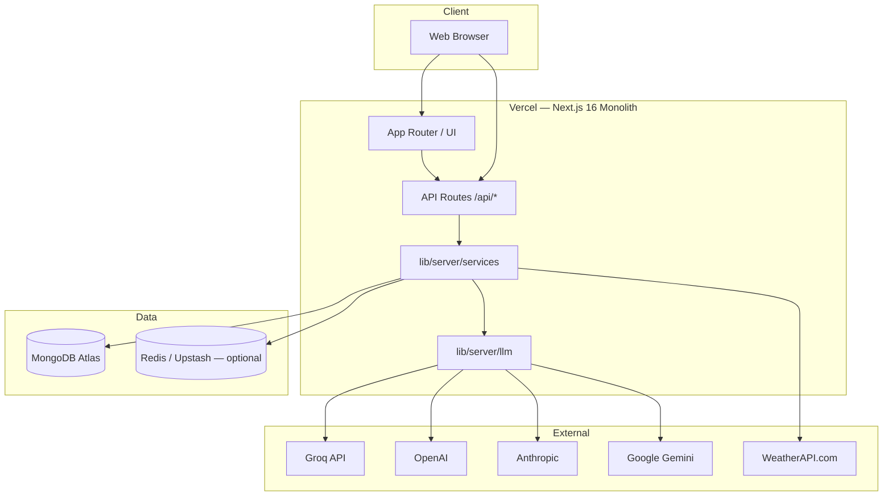

# Krashaq — System Architecture

> **Krashaq** is an AI-powered agritech platform for Indian farmers: weather, irrigation advice, multilingual chat, and farmer management.

## High-level architecture (production)



## Monolith vs legacy backend

| Layer | Status | Location |
|-------|--------|----------|
| UI (dashboard, chat, auth pages) | ✅ Production | `frontend/app/` |
| Chat, weather, auth, farmers API | ✅ Native Next.js | `frontend/app/api/` + `lib/server/` |
| Multi-provider LLM | ✅ Native | `lib/server/llm/` |
| Admin, messages, 2FA, locations | ⏳ Legacy proxy | `LEGACY_PYTHON_URL` → FastAPI |
| WhatsApp webhooks | ⏳ Python only | `backend/app/routes/webhook.py` |

The **recommended production path** is the Next.js monolith on Vercel. The Python backend is optional during migration.

## Frontend structure

```
frontend/
├── app/                    # Next.js App Router
│   ├── api/                # Serverless API (monolith backend)
│   ├── auth/               # Login, signup, OAuth callback
│   ├── admin/              # Admin dashboard pages
│   └── page.tsx            # Farmer dashboard
├── modules/                # Feature modules
│   ├── conversation/       # Chat UI + ModelSelector
│   ├── admin/              # Admin components
│   ├── auth/               # ProtectedRoute
│   ├── farmers/            # FarmerForm
│   └── common/             # Layout, weather, theme
├── lib/
│   ├── server/             # Server-only: DB, auth, LLM, services
│   └── api/                # Browser HTTP client
├── contexts/               # AuthContext, ToastContext
└── components/ui/          # shadcn/ui primitives
```

## LLM architecture

1. User selects **provider + model** in chat UI (`ModelSelector`).
2. `POST /api/chat` → `processChat()` → `resolveLLM()` with fallback chain.
3. Supported providers: Groq (default), OpenAI, Anthropic, Gemini, xAI, DeepSeek, Mistral, Ollama.
4. Tool context (weather, irrigation) injected as system messages before LLM invoke.

Config: `LLM_PROVIDER`, `LLM_FALLBACK_CHAIN`, per-provider API keys — see [ENVIRONMENT.md](./ENVIRONMENT.md).

## Authentication

- Email/password: bcrypt hashes in MongoDB `users` collection.
- JWT access (30m) + refresh (7d) tokens via `jose`.
- Google OAuth: requires legacy backend or future port (`/api/auth/google/*`).

## Data model (MongoDB)

| Collection | Purpose |
|------------|---------|
| `users` | Farmers, admins, suppliers |
| `refresh_tokens` | JWT refresh token rotation |
| `chat_sessions` | Conversation history by session_id |

## Security considerations

- Secrets only in environment variables (never committed).
- API routes are serverless — no client-side DB access.
- Admin routes require `role: admin` (when fully ported).
- Rate limiting: add Vercel Firewall / Upstash Ratelimit for production scale.

## Deployment target

- **Platform:** Vercel (region `bom1` — Mumbai)
- **Root directory:** `frontend`
- **Database:** MongoDB Atlas (required for serverless)
- **Cache:** Upstash Redis (optional)

See [DEPLOYMENT.md](./DEPLOYMENT.md) for step-by-step instructions.
