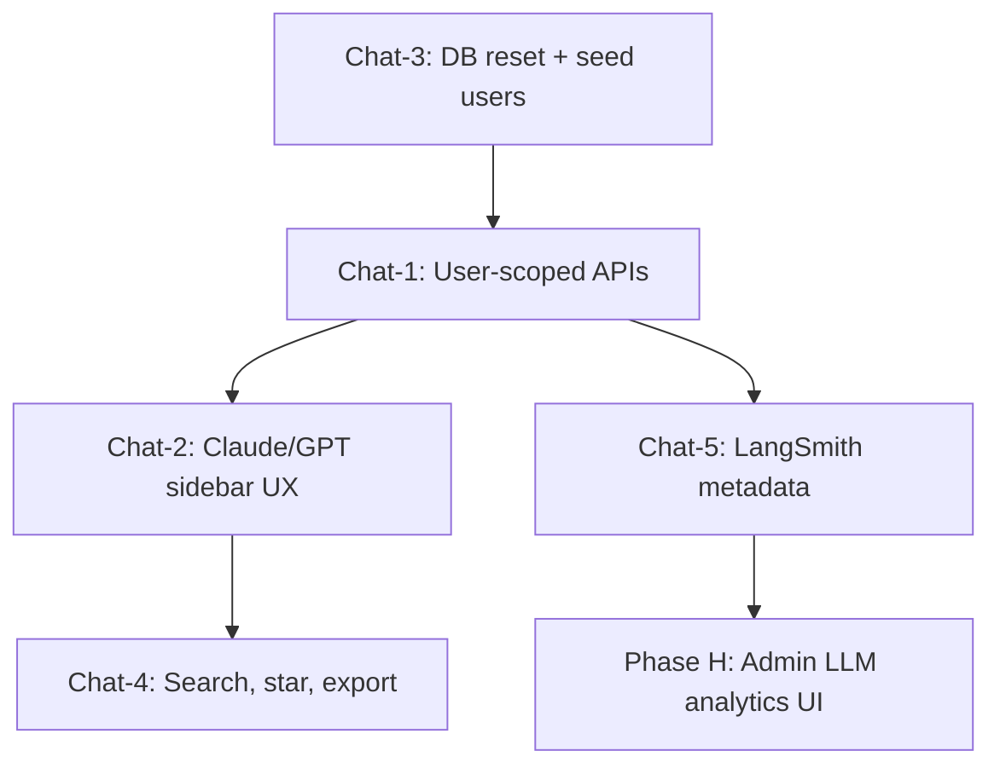

# Krashaq Chat Enhancement Plan — User-Scoped Sessions & Claude/GPT UX

> Version 1.0 · Aug 2026  
> Scope: User-specific chat sessions, Claude/ChatGPT-style management UI, database reset + seed users  
> Depends on: **Phase A** (auth/refresh) and **Phase B** (RBAC) — already done  
> Stack: Next.js 16 · MongoDB · SSE streaming · existing `KrashaqChat` + sidebar

---

## 0. Current state (audit)

### What works today

| Area | Status | Location |
|------|--------|----------|
| Streaming chat (SSE) | ✅ | `POST /api/chat/stream` |
| Session storage | ✅ | MongoDB `chat_sessions` collection |
| Sidebar chat list | ✅ | `SidebarNav` + `ChatSessionsContext` |
| Auto-title from first message | ✅ | `chat-memory.ts` → `deriveTitle()` |
| Delete session | ✅ | `DELETE /api/messages?session_id=` |
| Markdown + message actions | ✅ | `KrashaqChat`, `ChatMessageList` |
| Model selector pill | ✅ | `ModelSelectorPill` + LLM prefs in localStorage |

### Critical gaps

| Gap | Risk / impact |
|-----|----------------|
| **No `user_id` on `chat_sessions`** | All users see the same global session list |
| **No auth on chat APIs** | Anyone can read/delete any session by guessing `session_id` |
| **`GET /api/messages/sessions` unauthenticated** | Cross-user history leak |
| **`POST /api/chat/stream` unauthenticated** | Anonymous sessions pollute DB |
| **Client uses plain `fetch`** | No Bearer token on session list/delete |
| **No rename, search, or bulk delete** | Missing Claude/GPT power features |
| **No seed/reset script** | Hard to demo roles or test in clean state |
| **`.env.example` has no demo credentials** | Onboarding friction for devs |

### Target data model

```typescript
// chat_sessions collection (after migration)
{
  session_id: string,          // UUID, e.g. "sess_abc123"
  user_id: string,             // FK → users._id (required)
  title: string,               // auto from first user message
  messages: StoredMessage[],
  created_at: Date,
  updated_at: Date,
  pinned?: boolean,            // Phase 2
  archived?: boolean,          // Phase 2
}
```

**Index:** `{ user_id: 1, updated_at: -1 }`

---

## 1. Phase overview

| Phase | Focus | Duration | Depends on |
|-------|--------|----------|------------|
| **Chat-1** | User-scoped sessions + auth on all chat APIs | 3–4 days | Phase A, B |
| **Chat-2** | Claude/GPT sidebar UX (rename, search, grouped list) | 3–4 days | Chat-1 |
| **Chat-3** | DB reset script + 3 role seed users + `.env.example` | 1 day | Chat-1 |
| **Chat-4** | Power features (star, export, regenerate polish) | 1 week | Chat-2 |
| **Chat-5** | LangSmith tracing metadata on chat (feeds Phase H) | 2–3 days | Chat-1 |

**Recommended order:** Chat-3 can run in parallel with Chat-1 (seed users needed for testing Chat-1).  
**Start with Chat-1** — security/scoping is blocking everything else.

---

## 2. Chat-1 — User-scoped sessions & API auth

**Goal:** Each user only sees and owns their chats. No cross-user access.

### Chat-1.1 Schema migration

| Task | Detail |
|------|--------|
| Add `user_id` field | Required on all new sessions |
| Backfill or wipe | **Recommended:** wipe `chat_sessions` (see Chat-3) rather than orphan migration |
| MongoDB index | `{ user_id: 1, updated_at: -1 }` |
| Session ID format | `sess_${randomUUID()}` — drop legacy `phone_*` pattern for web users |

**Files:** `lib/server/services/chat-memory.ts`

### Chat-1.2 Server API changes

| Route | Change |
|-------|--------|
| `POST /api/chat/stream` | `requireAuth` → pass `user.id` into `processChatStream` |
| `POST /api/chat` | Same auth + user scoping |
| `GET /api/messages/sessions` | `requireAuth` → `listSessions(userId)` |
| `GET /api/messages` | Auth + verify `session.user_id === user.id` |
| `DELETE /api/messages` | Auth + ownership check before delete |
| `PATCH /api/messages/sessions/[id]` | **New** — rename title (auth + ownership) |
| `POST /api/messages/[id]/feedback` | Auth + ownership on existing route |

**New helpers in `chat-memory.ts`:**

```typescript
listSessionsForUser(userId: string, limit?: number)
getSessionForUser(userId: string, sessionId: string)
deleteSessionForUser(userId: string, sessionId: string)
renameSessionForUser(userId: string, sessionId: string, title: string)
createSessionForUser(userId: string): string
```

**New helper in `chat.ts`:**

```typescript
// getOrCreateSession(userId, sessionId?) — always sets user_id on upsert
```

### Chat-1.3 Client changes

| Task | Detail |
|------|--------|
| `ChatSessionsContext` | Use `fetchWithAuth` from `AuthContext` for all session APIs |
| Gate chat routes | Wrap `/chat` in `ProtectedRoute` (login required) |
| Clear sessions on logout | Reset `ChatSessionsContext` state when user logs out |
| 403 handling | Toast: "Session not found" if user opens another user's URL |

**Files:** `contexts/ChatSessionsContext.tsx`, `app/chat/page.tsx`, `app/chat/[sessionId]/page.tsx`

### Chat-1.4 Acceptance criteria

- [ ] Farmer A cannot list Farmer B's sessions (empty list or 403)
- [ ] Unauthenticated `GET /api/messages/sessions` → 401
- [ ] Unauthenticated `POST /api/chat/stream` → 401
- [ ] Opening `/chat/{other-user-session-id}` → 404 or redirect
- [ ] New chat creates session with correct `user_id` in MongoDB
- [ ] Unit tests for `listSessionsForUser` scoping

---

## 3. Chat-2 — Claude/GPT-style chat management UI

**Goal:** Sidebar and chat UX on par with Claude/ChatGPT for daily use.

### Chat-2.1 Sidebar enhancements

| Feature | Claude/GPT reference | Implementation |
|---------|---------------------|----------------|
| **Recent chats list** | Scrollable, truncated titles | Already exists — polish empty/loading states |
| **New chat button** | Top of sidebar | Already exists |
| **Rename chat** | Inline or modal rename | Dropdown → "Rename" → `PATCH /api/messages/sessions/[id]` |
| **Delete chat** | Hover ⋯ menu | Already exists — add confirm dialog |
| **Search chats** | Search box above list | Client filter + `GET /api/messages/sessions?q=` (server optional) |
| **Date grouping** | Today / Yesterday / Previous 7 days | Group `sessions` by `updated_at` in sidebar |
| **Active chat highlight** | Primary tint on current | Already exists |
| **Collapsed rail tooltips** | Icon-only mode | Already exists |

**Files:** `SidebarNav.tsx`, new `ChatSessionItem.tsx`, `RenameSessionDialog.tsx`

### Chat-2.2 Chat page UX

| Feature | Detail |
|---------|--------|
| Empty state | Centered prompt chips (crop, weather, pest) — like GPT starter prompts |
| Streaming indicator | Typing dots / cursor while assistant streams |
| Stop generation | Already in `useChatStream` — ensure button visible |
| Regenerate last reply | Wire `regenerate()` in composer actions |
| Copy message | Per-message action (clipboard API) |
| Auto-scroll | Stick to bottom on new tokens; pause if user scrolls up |
| URL sync | `/chat/[sessionId]` updates on first message (already partial) |
| Mobile | Bottom nav Chat tab; session list in sheet (existing mobile sidebar) |

**Files:** `KrashaqChat.tsx`, `ChatComposer.tsx`, `ChatMessageList.tsx`, `MessageActions.tsx`

### Chat-2.3 Session lifecycle

```
User clicks "New chat"
  → router.push('/chat')          // no session_id yet
  → User sends first message
  → stream returns session_id
  → router.replace('/chat/{id}')  // URL updates
  → sidebar refreshes, new item at top
```

### Chat-2.4 Acceptance criteria

- [ ] Rename updates title in sidebar without page reload
- [ ] Search filters sidebar list by title
- [ ] Sessions grouped by Today / Yesterday / Older
- [ ] Delete shows confirmation dialog
- [ ] Empty `/chat` shows starter prompt chips
- [ ] Regenerate replaces last assistant message

---

## 4. Chat-3 — Database reset + seed users + `.env.example`

**Goal:** One command to wipe dev DB and create 3 demo users (admin, supplier, farmer) with documented credentials.

### Chat-3.1 Reset script

**File:** `scripts/reset-and-seed.ts` (or `.mjs`)

```bash
npm run db:reset   # adds script to package.json
```

| Step | Action |
|------|--------|
| 1 | Connect to MongoDB from `MONGODB_URL` + `MONGODB_DB` |
| 2 | **Drop collections:** `users`, `refresh_tokens`, `chat_sessions`, `email_logs` |
| 3 | Create indexes (users email unique, chat_sessions user_id, refresh_tokens token) |
| 4 | Insert 3 seed users (see below) |
| 5 | Optionally insert 1 demo chat per user |
| 6 | Print credentials table to stdout |

**Safety:** Script refuses to run if `NODE_ENV=production` unless `--force` flag passed.

### Chat-3.2 Seed users

| Role | Email | Password | Name | Notes |
|------|-------|----------|------|-------|
| Admin | `admin@krashaq.dev` | `Admin@12345` | Krashaq Admin | Full `/admin` access |
| Supplier | `supplier@krashaq.dev` | `Supplier@12345` | Agro Supply Co | Can manage farmers |
| Farmer | `farmer@krashaq.dev` | `Farmer@12345` | Ram Kumar | Dashboard + chat only |

**Shared location (for weather demos):**

```json
{ "state": "Madhya Pradesh", "district": "Bhopal", "tehsil": "Huzur", "locality": "Arera Colony", "pincode": "462016" }
```

**Supplier → farmer link:** Seed farmer user has `supplier_id` = supplier user's `_id`.

### Chat-3.3 `.env.example` additions

Add a **Demo accounts (after `npm run db:reset`)** section:

```env
# ── Demo accounts (local dev — run: npm run db:reset) ────────────
# Admin:    admin@krashaq.dev    / Admin@12345
# Supplier: supplier@krashaq.dev / Supplier@12345
# Farmer:   farmer@krashaq.dev   / Farmer@12345

# ── Email (optional — logs to console if unset) ─────────────────
APP_URL=http://localhost:3000
SMTP_HOST=
SMTP_PORT=587
SMTP_USER=
SMTP_PASS=
SMTP_FROM=Krashaq <noreply@krashaq.app>

# ── LangSmith (optional — Phase H) ─────────────────────────────
# LANGCHAIN_TRACING_V2=true
# LANGCHAIN_API_KEY=
# LANGCHAIN_PROJECT=krashaq-dev
```

Also align `MONGODB_DB` default with `config.ts` (`krashaq` vs `krashaq_ai` — pick one and document).

### Chat-3.4 Acceptance criteria

- [ ] `npm run db:reset` completes without error on empty DB
- [ ] All 3 users can log in via `/auth/login`
- [ ] Each role sees correct sidebar (farmer has no Farmers link)
- [ ] `.env.example` documents demo credentials clearly
- [ ] Script blocked in production without `--force`

---

## 5. Chat-4 — Power features (post-MVP polish)

**Goal:** Feature parity with Claude/GPT extras; migrate remaining proxied message routes.

### Chat-4.1 Native route migration

| Proxied route | Native replacement |
|---------------|-------------------|
| `GET /api/messages/search` | Search messages within user's sessions |
| `GET /api/messages/starred` | Starred messages per user |
| `POST /api/messages/[id]/star` | Toggle star (scoped) |
| `GET /api/messages/export` | Export session as markdown/JSON |
| `POST /api/messages/[id]/retry` | Regenerate from message (scoped) |

All routes: **auth + user_id scope**.

### Chat-4.2 Optional UX

| Feature | Priority |
|---------|----------|
| Pin chat to top | P2 |
| Archive chat (hide from main list) | P2 |
| Bulk delete selected chats | P3 |
| Share read-only link | P3 (out of scope for agritech MVP) |
| Chat folders / projects | P3 |

### Chat-4.4 Acceptance criteria

- [ ] Search returns only current user's messages
- [ ] Export downloads markdown for owned session only
- [ ] No message routes return 501 (Python proxy)

---

## 6. Chat-5 — LangSmith tracing hook (feeds Phase H)

**Goal:** Every chat stream creates a trace with user/session metadata for admin analytics.

| Task | Detail |
|------|--------|
| Attach metadata on stream | `user_id`, `session_id`, `role`, `provider`, `model` |
| Tags | `krashaq`, `chat`, `{provider}`, `stream` |
| Config | `LANGCHAIN_TRACING_V2`, `LANGCHAIN_API_KEY`, `LANGCHAIN_PROJECT` |

**Files:** `lib/server/services/chat.ts`, `lib/server/config.ts`

**Acceptance:** Send test chat → run appears in LangSmith within ~5s.

---

## 7. File change map (summary)

```
lib/server/services/
├── chat-memory.ts       EXTEND — user_id scoping, rename, indexes
├── chat.ts              EXTEND — require userId in all paths

lib/server/auth/
└── rbac.ts              USE — requireAuth on chat routes

app/api/
├── chat/stream/route.ts       AUTH + user_id
├── messages/route.ts          AUTH + ownership
├── messages/sessions/route.ts AUTH + filter by user
└── messages/sessions/[id]/route.ts  NEW — PATCH rename

contexts/
└── ChatSessionsContext.tsx    fetchWithAuth, logout reset

modules/conversation/
├── components/KrashaqChat.tsx       UX polish
├── components/ChatSessionItem.tsx   NEW
└── components/RenameSessionDialog.tsx NEW

modules/common/components/layout/
└── SidebarNav.tsx             grouped list, search, rename

scripts/
└── reset-and-seed.ts          NEW

.env.example                   demo users + SMTP + LangSmith
package.json                   "db:reset" script
```

---

## 8. Testing plan

| Phase | Tests |
|-------|-------|
| Chat-1 | Integration: user A vs B session isolation; 401 without token; ownership on DELETE |
| Chat-2 | Component: rename dialog, search filter, date grouping |
| Chat-3 | Script: seed users login E2E; production guard |
| Chat-4 | Integration: search/export scoped; no 501 on message routes |
| Chat-5 | Manual: LangSmith run with correct metadata |

**Manual smoke checklist (after Chat-1 + Chat-3):**

1. Run `npm run db:reset`
2. Login as `farmer@krashaq.dev` → send chat → see only own session in sidebar
3. Login as `supplier@krashaq.dev` → separate session list
4. Login as `admin@krashaq.dev` → separate session list + admin nav
5. Logout → session list clears
6. Try `/chat/{other-session-id}` while logged in as different user → blocked

---

## 9. Execution order (mermaid)



**Parallel track:** Chat-3 first (or same day as Chat-1 start) so you have demo users to test scoping immediately.

---

## 10. Out of scope (later)

- Multi-device real-time sync (WebSocket)
- Shared team chats (supplier viewing farmer's chat)
- Voice input / WhatsApp bridge integration
- Chat quota per role (Phase H optional enhancement)

---

## 11. Success metrics

| Metric | Target |
|--------|--------|
| Cross-user session access | 0 leaks (403/404 always) |
| Chat APIs requiring auth | 100% |
| Sidebar UX parity with GPT | Rename, search, grouped list, delete confirm |
| Dev onboarding time | `< 5 min` with `db:reset` + `.env.example` |
| Demo users for all 3 roles | Always available after seed |

---

*Next step: Approve **Chat-1 + Chat-3** to start (security + demo data), then **Chat-2** for UX polish.*
