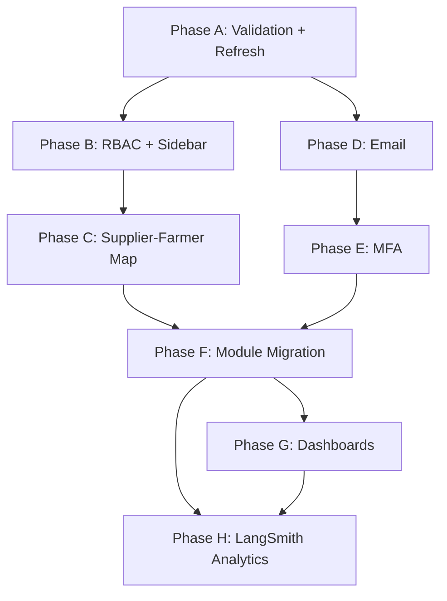

# Krashaq Platform Master Plan — Auth, RBAC, MFA & Email

> Version 1.1 · Aug 2026  
> Scope: Fix all modules, refresh tokens, RBAC (admin / supplier / farmer), farmer↔supplier mapping, validation, MFA, Nodemailer notifications, **LangSmith LLM analytics for admin**  
> Stack: Next.js 16 monolith · MongoDB · Redis (optional) · Nodemailer · Zod · otplib · **LangSmith**

---

## 0. Current state audit

### What works today (native monolith)

| Area | Status | Location |
|------|--------|----------|
| Signup / email login | ✅ Native | `lib/server/services/auth-service.ts` |
| JWT access + refresh issue | ✅ Native | `lib/server/auth/jwt.ts` |
| Refresh endpoint | ✅ Native | `POST /api/auth/refresh` |
| Logout (revoke refresh) | ✅ Native | `POST /api/auth/logout` |
| `/api/auth/me` | ✅ Native | Bearer token |
| Farmers CRUD (basic) | ✅ Native | `farmers-service.ts` — no RBAC |
| Chat, weather, locations | ✅ Native | — |
| UI theme + chat + sidebar | ✅ Done | Phases 1–2 UI |

### What is broken or incomplete

| Gap | Impact |
|-----|--------|
| **~45 API routes** still `proxyToLegacyPython` (501 without Python) | 2FA, email verify, password reset, admin, message extras |
| **No auto refresh** on 401 — client stores tokens but never proactively refreshes | Sessions die silently after 30 min |
| **Role inconsistency** — `pestisides-supplier` vs `supplier` | RBAC checks fail |
| **No supplier_id** on farmers | Cannot map many farmers → one supplier |
| **Farmers API unauthenticated** | Anyone can list/create farmers |
| **No input validation layer** (Zod) | Bad data reaches MongoDB |
| **No Nodemailer** | No welcome, verify, reset, or alert emails |
| **MFA routes proxied** | 2FA UI/settings non-functional in monolith |
| **Sidebar same for all roles** | Supplier sees admin paths; farmer sees supplier tools |
| **Admin pages** call proxied APIs | Admin dashboard broken without Python |
| **`/api/llm/metrics` proxied** | No LLM token/cost/latency visibility in monolith |
| **LangSmith only in Python backend** | Next.js chat/stream not traced; admin can't see runs |

### Target role model

```
┌──────────┐     manages many      ┌──────────┐
│  ADMIN   │ ────────────────────► │  ALL     │
└──────────┘                       └──────────┘

┌──────────┐     manages many      ┌──────────┐
│ SUPPLIER │ ────────────────────► │ FARMERS  │
└──────────┘   supplier_id FK      └──────────┘

┌──────────┐
│  FARMER  │  → own dashboard, chat, weather (supplier optional link)
└──────────┘
```

| Role | Slug in DB | Can access |
|------|------------|------------|
| Admin | `admin` | Everything + `/admin/*` |
| Supplier | `supplier` | Own farmers, own supplier dashboard, chat |
| Farmer | `farmer` | Dashboard, chat, profile (own data only) |

---

## 1. Architecture target

### New server modules

```
lib/server/
├── auth/
│   ├── jwt.ts              (existing — add rotation)
│   ├── password.ts         (existing)
│   ├── rbac.ts             NEW — requireRole, canAccessFarmer
│   ├── mfa-service.ts      NEW — TOTP + backup codes
│   └── session-service.ts  NEW — refresh rotation, device sessions
├── email/
│   ├── mailer.ts           NEW — Nodemailer transport
│   └── templates.ts        NEW — HTML templates
├── validation/
│   ├── auth.schemas.ts     NEW — Zod
│   ├── farmer.schemas.ts   NEW
│   └── common.ts           NEW — phone, email, pincode
└── services/
    ├── auth-service.ts     EXTEND — 2FA gate on login, roles
    ├── farmers-service.ts  EXTEND — supplier_id scoping
    └── notification-service.ts NEW — queue + send
```

### Client modules

```
lib/api/
└── authenticated-fetch.ts  NEW — attach token, refresh on 401

contexts/
└── AuthContext.tsx         EXTEND — roles, supplier_id, refresh interval

components/auth/
├── RoleGuard.tsx           NEW — wrap routes by role
├── MfaChallenge.tsx        NEW — login step 2
└── ProtectedRoute.tsx      EXTEND — role + MFA pending
```

### MongoDB schema (users collection)

```typescript
{
  _id: string,
  email: string,
  name: string,
  password_hash?: string,
  phone?: string,
  role: 'admin' | 'supplier' | 'farmer',
  supplier_id?: string | null,      // farmer → parent supplier user id
  location: { state, district, tehsil, locality, pincode },
  email_verified: boolean,
  email_verification_token?: string,
  two_factor_enabled: boolean,
  two_factor_secret?: string,       // encrypted TOTP secret
  two_factor_backup_codes?: string[], // hashed
  is_active: boolean,
  created_at, updated_at
}
```

---

## 2. Phase overview

| Phase | Focus | Duration | Depends on |
|-------|--------|----------|------------|
| **A** | Validation + auth hardening + refresh tokens | 1 week | — |
| **B** | RBAC + role-based sidebar & route guards | 1 week | A |
| **C** | Supplier ↔ farmer mapping + scoped APIs | 1 week | B |
| **D** | Nodemailer + notification events | 1 week | A |
| **E** | MFA (TOTP + email OTP fallback) | 1 week | A, D |
| **F** | Module fixes + migrate legacy auth/admin routes | 1–2 weeks | B, C |
| **G** | Supplier dashboard + admin native APIs | 1 week | C, F |
| **H** | **LangSmith LLM analytics (admin dashboard)** | 1 week | F, chat auth |

---

## 3. Phase A — Validation, auth hardening & refresh tokens

**Goal:** Every API input validated; tokens refresh automatically; no silent logouts.

### A.1 Zod validation layer

| Schema | Validates |
|--------|-----------|
| `signupSchema` | email, password ≥8, name, phone optional E.164, location hierarchy |
| `loginSchema` | email, password |
| `farmerCreateSchema` | name, phone +91, location optional |
| `refreshSchema` | refresh_token non-empty |
| `roleUpdateSchema` | admin-only role changes |

**Files:** `lib/server/validation/*.ts`  
**Pattern:** `parseBody(request, schema)` helper returns `{ data } | { error, status: 400 }`

### A.2 Refresh token improvements (server)

| Task | Detail |
|------|--------|
| Token rotation | On refresh: revoke old refresh token, issue new pair |
| Expiry check | Reject expired tokens from `refresh_tokens` collection |
| Device metadata | Store `user_agent`, `ip`, `created_at` per session |
| List sessions | Native `GET /api/auth/sessions` (replace proxy) |
| Revoke session | Native `DELETE /api/auth/sessions/[id]` |

### A.3 Refresh token improvements (client)

| Task | Detail |
|------|--------|
| `authenticatedFetch()` | Wrapper: attach Bearer, on 401 → refresh → retry once |
| Proactive refresh | Refresh access token at 80% of TTL (e.g. every 24 min if 30 min TTL) |
| `AuthContext` | Export `getAccessToken()`, use fetch wrapper app-wide |
| Fix user `id` type | `string` (UUID) not `number` |

### A.4 Auth route fixes

- Standardize error shape: `{ detail: string, code?: string }`
- Signup: validate body before DB; return 422 with field errors
- Login: return `{ requires_2fa: true, temp_token }` when MFA enabled (prep for Phase E)

**Acceptance criteria**

- [ ] Invalid signup returns field-level errors
- [ ] Access token auto-refreshes without user action
- [ ] Refresh rotation prevents token reuse
- [ ] Session list visible in profile settings

---

## 4. Phase B — RBAC & role-based UI

**Goal:** Each role sees only what they should; APIs enforce same rules.

### B.1 RBAC server (`lib/server/auth/rbac.ts`)

```typescript
type Role = 'admin' | 'supplier' | 'farmer';

const PERMISSIONS = {
  admin: ['*'],
  supplier: ['farmers:read:own', 'farmers:write:own', 'chat', 'weather', 'profile'],
  farmer: ['chat', 'weather', 'profile:own'],
};

function requireAuth(request): AuthUser
function requireRole(user, ...roles): void
function requireAdmin(user): void
function requireSupplierOrAdmin(user): void
```

Apply to: `/api/farmers/*`, `/api/chat`, `/api/admin/*`, `/api/auth/me/*`

### B.2 Role normalization migration

- Migrate `pestisides-supplier` → `supplier` in DB script
- Update `AuthContext`: `isSupplier()`, `isFarmer()`, `isAdmin()`
- Signup default role: `farmer`; admin creates suppliers via admin panel

### B.3 Sidebar & navigation by role

| Nav item | Farmer | Supplier | Admin |
|----------|--------|----------|-------|
| Dashboard `/` | ✅ | ✅ | ✅ |
| Chat `/chat` | ✅ | ✅ | ✅ |
| Farmers `/farmers` | ❌ | ✅ (own only) | ✅ (all) |
| Suppliers `/suppliers` | ❌ | ❌ | ✅ |
| Profile | ✅ | ✅ | ✅ |
| Admin `/admin` | ❌ | ❌ | ✅ |

**Files:** `SidebarNav.tsx`, `BottomNav.tsx`, new `RoleGuard.tsx`

### B.4 Route protection

- Wrap `/admin/*` with `requireRole('admin')`
- Wrap `/farmers` with `requireRole('supplier', 'admin')`
- Farmer hitting `/farmers` → redirect `/` with toast

**Acceptance criteria**

- [ ] Farmer cannot call `GET /api/farmers` (403)
- [ ] Sidebar hides irrelevant items per role
- [ ] Admin link only for admin

---

## 5. Phase C — Supplier ↔ farmer mapping

**Goal:** Many farmers belong to one supplier; data scoped correctly.

### C.1 Data model

- Add `supplier_id: string | null` on user documents where `role === 'farmer'`
- Supplier user document: `role: 'supplier'`, no `supplier_id`
- Index: `{ supplier_id: 1, role: 1 }`

### C.2 Business rules

| Action | Who | Rule |
|--------|-----|------|
| Create farmer | Supplier | Auto-set `supplier_id = supplier._id` |
| Create farmer | Admin | Must pass `supplier_id` in body |
| List farmers | Supplier | `find({ supplier_id: me.id })` |
| List farmers | Admin | All farmers + supplier name join |
| Update/delete farmer | Supplier | Only if `farmer.supplier_id === me.id` |
| Signup as farmer | Self | `supplier_id: null` until linked by supplier |

### C.3 APIs

| Endpoint | Change |
|----------|--------|
| `POST /api/farmers` | Auth + RBAC + set supplier_id |
| `GET /api/farmers` | Scoped list + `?supplier_id=` for admin |
| `GET /api/farmers/[id]` | Ownership check |
| `PATCH /api/farmers/[id]/assign` | Admin: link farmer to supplier |
| `GET /api/suppliers` | Admin only — list suppliers with farmer counts |
| `GET /api/suppliers/me/farmers` | Supplier shortcut |

### C.4 UI

- **Supplier farmers page:** table with name, phone, location, last active
- **Admin users page:** assign farmer → supplier dropdown
- **Farmer profile:** show linked supplier name (read-only)
- **Signup:** optional supplier code field (future: invite link)

**Acceptance criteria**

- [ ] Supplier A cannot see Supplier B's farmers
- [ ] Admin can reassign farmer to different supplier
- [ ] Farmer count per supplier on admin dashboard

---

## 6. Phase D — Email notifications (Nodemailer)

**Goal:** Transactional email for auth and operational events.

### D.1 Infrastructure

```bash
npm install nodemailer
npm install -D @types/nodemailer
```

**Env vars:**

```env
SMTP_HOST=smtp.gmail.com
SMTP_PORT=587
SMTP_USER=
SMTP_PASS=
SMTP_FROM=Krashaq <noreply@krashaq.app>
APP_URL=https://your-app.vercel.app
```

**Files:** `lib/server/email/mailer.ts`, `templates.ts`

### D.2 Email events

| Event | Template | Trigger |
|-------|----------|---------|
| Welcome | `welcome.html` | After signup |
| Verify email | `verify-email.html` | Signup + resend |
| Password reset | `reset-password.html` | Forgot password |
| Password changed | `password-changed.html` | After reset |
| MFA enabled | `mfa-enabled.html` | 2FA setup |
| New farmer linked | `farmer-linked.html` | Supplier adds farmer |
| Login from new device | `new-login.html` | Optional — new session |

### D.3 Native routes (replace proxies)

| Route | Method |
|-------|--------|
| `/api/auth/verify-email` | GET `?token=` |
| `/api/auth/resend-verification` | POST |
| `/api/auth/forgot-password` | POST |
| `/api/auth/reset-password` | POST |

### D.4 Notification service

- `notification-service.ts`: `sendEmail(to, template, vars)` + log to `email_logs` collection
- Fail gracefully if SMTP not configured (dev mode: log to console)

**Acceptance criteria**

- [ ] Signup sends welcome + verification email
- [ ] Password reset flow works end-to-end
- [ ] Emails use portfolio emerald branding in HTML template

---

## 7. Phase E — MFA (multi-factor authentication)

**Goal:** TOTP authenticator app + email OTP fallback; integrated in login flow.

### E.1 Dependencies

```bash
npm install otplib qrcode
npm install -D @types/qrcode
```

### E.2 Server flows

**Enable MFA (`POST /api/auth/2fa/enable`):**

1. Generate TOTP secret (otplib)
2. Return QR code data URL + manual entry key
3. User confirms with 6-digit code → store encrypted secret, set `two_factor_enabled: true`
4. Generate 10 backup codes (hashed in DB)
5. Email "MFA enabled" notification

**Login with MFA:**

1. Email/password valid → if `two_factor_enabled`: return `{ requires_2fa: true, mfa_token }` (short-lived JWT, 5 min)
2. `POST /api/auth/verify-2fa` with `{ mfa_token, code }` → verify TOTP or backup code → issue full tokens

**Disable MFA:** require password + current TOTP

### E.3 UI

- `/profile/settings` → Security section: Enable / Disable 2FA
- `/auth/login` → after credentials, show `MfaChallenge` component (6-digit input)
- Backup codes display once on setup (copy / download)

### E.4 Email OTP fallback (optional within Phase E)

- `POST /api/auth/2fa/send-email-otp` — 6-digit code, 10 min TTL in Redis/Mongo
- Button on MFA screen: "Send code to email"

**Acceptance criteria**

- [ ] Google Authenticator / Authy works with Krashaq
- [ ] Backup code works once then invalidated
- [ ] Login blocked until MFA verified when enabled

---

## 8. Phase F — Module fixes & legacy migration

**Goal:** Every sidebar module works without Python backend.

### F.1 Priority migration order

| Priority | Routes | Used by |
|----------|--------|---------|
| P0 | Auth (remaining proxies) | Login, profile, settings |
| P1 | `/api/farmers/*` + RBAC | Farmers module |
| P2 | `/api/admin/dashboard`, `/api/admin/users` | Admin home |
| P3 | `/api/messages/*` extras (star, search, export) | Chat power features |
| P4 | `/api/admin/health`, audit, scheduler | Admin ops |

### F.2 Per-module fix checklist

| Module | Route | Fixes needed |
|--------|-------|--------------|
| **Dashboard** | `/` | Role-specific widgets; supplier sees farmer count |
| **Chat** | `/chat` | Auth on stream; scope sessions by user id |
| **Farmers** | `/farmers` | RBAC + supplier scope (Phase C) |
| **Profile** | `/profile` | Native me API; fix API base URL |
| **Settings** | `/profile/settings` | Password change native; MFA UI |
| **Admin** | `/admin/*` | Native dashboard + users APIs |
| **Auth** | `/auth/*` | MFA step; email verify links |

### F.3 Chat session scoping

- Add `user_id` to `chat_sessions` documents
- Filter sessions list by authenticated user
- Prevents cross-user chat history leak

**Acceptance criteria**

- [ ] App fully functional with `LEGACY_PYTHON_URL` unset
- [ ] All sidebar links load without 501 errors

---

## 9. Phase G — Supplier & admin dashboards

**Goal:** Role-specific home screens with actionable data.

### G.1 Supplier dashboard (`/supplier` or `/` when role=supplier)

- KPI cards: My farmers, Active today, Pending advisories
- Quick actions: Add farmer, Open chat
- Recent farmer activity list

### G.2 Admin dashboard (enhance `/admin`)

- KPIs: Total users, farmers, suppliers, active sessions
- User management: role change, ban, assign farmer→supplier
- System health (native): MongoDB, LLM providers, SMTP status

### G.3 Farmer dashboard (existing `/`)

- Keep weather + irrigation + chat preview
- Show linked supplier contact card if `supplier_id` set

**Acceptance criteria**

- [ ] Each role lands on meaningful home content
- [ ] Admin can create supplier accounts and assign farmers

---

## 10. Phase H — LangSmith LLM analytics (admin)

**Goal:** Admin sees token usage, costs, latency, errors, and request/response traces for all Krashaq LLM calls — powered by LangSmith, displayed in `/admin/analytics`.

### H.0 Why LangSmith

| Approach | Pros | Cons |
|----------|------|------|
| **LangSmith** (chosen) | Already in LangChain stack; auto-traces prompts/completions; token + cost breakdown; run explorer UI | Requires API key; external dependency |
| Custom MongoDB logs | Full control | Must build token counting, cost calc, UI from scratch |
| Provider dashboards (Groq/OpenAI) | Native billing | Split across 8 providers; no unified view |

Python backend already enables LangSmith via `LANGCHAIN_TRACING_V2`. **Phase H brings the same to the Next.js monolith** and surfaces metrics in the admin UI.

### H.1 Architecture

```
┌─────────────────────────────────────────────────────────────┐
│  Chat / Stream API (Next.js)                                │
│  lib/server/services/chat.ts                                │
│       │                                                     │
│       ▼  LangChain invoke/stream + tracing metadata         │
│  LangSmith (cloud)  ◄── LANGCHAIN_API_KEY                   │
│       │                                                     │
│       ▼  REST API (server-side only)                        │
│  lib/server/services/langsmith-service.ts                   │
│       │                                                     │
│       ▼                                                     │
│  GET /api/admin/analytics/llm          (admin only)       │
│  GET /api/admin/analytics/llm/runs     (paginated traces)   │
│  GET /api/admin/analytics/llm/runs/[id] (single run detail) │
│       │                                                     │
│       ▼                                                     │
│  modules/admin/components/LlmAnalyticsDashboard.tsx         │
│  (extends /admin/analytics)                                 │
└─────────────────────────────────────────────────────────────┘
```

**Security:** LangSmith API key stays **server-only** (`LANGCHAIN_API_KEY`). Admin UI never exposes the key. All LangSmith calls go through authenticated admin API routes.

### H.2 Enable tracing in monolith

**Env vars** (mirror Python backend):

```env
LANGCHAIN_TRACING_V2=true
LANGCHAIN_API_KEY=lsv2_pt_...        # server-only, never NEXT_PUBLIC_
LANGCHAIN_PROJECT=krashaq             # LangSmith project name
LANGSMITH_ENDPOINT=https://api.smith.langchain.com  # optional, default
```

**Files to update:**

| File | Change |
|------|--------|
| `lib/server/config.ts` | Add `langsmithApiKey`, `langsmithProject`, `langsmithTracing` |
| `lib/server/services/chat.ts` | Pass `runName`, `tags`, `metadata` on every `invoke` / `stream` |
| `lib/server/llm/factory.ts` | Optional: wrap LLM with LangChain callbacks |

**Trace metadata (attach on every run):**

```typescript
{
  user_id: string,
  session_id: string,
  provider: 'groq' | 'openai' | ...,
  model: string,
  role: 'farmer' | 'supplier' | 'admin',
  tools_used?: string[],
  language?: string,
  location?: string,
}
```

**Tags:** `krashaq`, `chat`, `{provider}`, `{model}`, `stream` | `batch`

LangChain JS picks up tracing automatically when env vars are set at process start (set in `config.ts` or route entry).

### H.3 LangSmith service (`lib/server/services/langsmith-service.ts`)

Server-side client using `fetch` to LangSmith REST API (or `langsmith` npm SDK — already transitive dep via `@langchain/core`).

| Method | LangSmith API | Returns |
|--------|---------------|---------|
| `getProjectStats({ start, end, groupBy? })` | `POST /api/v1/runs/stats` | Aggregated tokens, cost, latency, error_rate |
| `queryRuns({ start, end, limit, cursor, filter? })` | `POST /api/v1/runs/query` | Paginated run list |
| `getRun(runId)` | `GET /api/v1/runs/{run_id}` | Full run: inputs, outputs, token counts |
| `getRunStatsByProvider()` | stats + `group_by: ['metadata.provider']` | Per-provider breakdown |
| `getRunStatsByModel()` | stats + `group_by: ['metadata.model']` | Per-model breakdown |

**Stats fields to pull:**

- `run_count`, `total_tokens`, `prompt_tokens`, `completion_tokens`
- `total_cost`, `prompt_cost`, `completion_cost`
- `latency_p50`, `latency_p99`, `latency_avg`
- `first_token_p50` (streaming TTFT)
- `error_rate`, `streaming_rate`

**Caching:** Redis or in-memory TTL 60s on stats endpoints to avoid LangSmith rate limits.

**Graceful degradation:** If `LANGCHAIN_API_KEY` unset → return `{ configured: false, message: 'LangSmith not configured' }` with empty charts (not 500).

### H.4 Admin API routes (native — replace proxies)

| Route | Auth | Query params |
|-------|------|--------------|
| `GET /api/admin/analytics/llm` | `admin` | `?range=24h\|7d\|30d` |
| `GET /api/admin/analytics/llm/runs` | `admin` | `?range=7d&limit=50&cursor=&provider=&model=&status=` |
| `GET /api/admin/analytics/llm/runs/[runId]` | `admin` | — |
| `GET /api/admin/analytics/llm/export` | `admin` | `?range=7d&format=csv` (optional) |

Replace proxied:

- `GET /api/llm/metrics` → thin wrapper or redirect to admin analytics
- `GET /api/admin/dashboard` → merge LLM summary KPIs from LangSmith stats

### H.5 Admin UI — LLM Analytics Dashboard

**Page:** `/admin/analytics` (tabbed or sections)

**Section 1 — KPI cards (above the fold)**

| KPI | Source |
|-----|--------|
| Total requests (24h / 7d) | `run_count` |
| Total tokens | `total_tokens` |
| Est. cost (USD) | `total_cost` |
| Avg latency | `latency_avg` |
| Error rate | `error_rate` |
| Streaming % | `streaming_rate` |

**Section 2 — Charts**

| Chart | Type | Data |
|-------|------|------|
| Token usage over time | Line / area | stats grouped by day |
| Cost over time | Line | `total_cost` by day |
| Tokens by provider | Donut | group_by provider |
| Tokens by model | Bar | group_by model |
| Latency p50 vs p99 | Dual line | time series |
| Prompt vs completion tokens | Stacked bar | daily split |

Use lightweight chart lib already in project or add **recharts** (small, React-friendly).

**Section 3 — Runs table**

| Column | Content |
|--------|---------|
| Time | `start_time` |
| User | `metadata.user_id` (link to admin user) |
| Provider / Model | badges |
| Tokens | prompt + completion = total |
| Latency | ms |
| Status | success / error |
| Actions | **View** → expand drawer; **Open in LangSmith** → external link |

**Section 4 — Run detail drawer**

- **Input:** user message (truncated + expand)
- **Output:** assistant reply (markdown)
- **Metadata:** provider, model, tools_used, session_id
- **Token breakdown:** prompt / completion / total
- **Latency:** total + time-to-first-token (if stream)
- Link: `https://smith.langchain.com/o/{org}/projects/p/{project}/r/{run_id}`

**Section 5 — Filters & controls**

- Date range: 24h / 7d / 30d / custom
- Filter by provider, model, status (error/success)
- Refresh button + last synced timestamp
- LangSmith status badge: 🟢 Connected / 🟡 Not configured

**Files:**

- `modules/admin/components/LlmAnalyticsDashboard.tsx` (new)
- `modules/admin/components/LlmRunDetailDrawer.tsx` (new)
- `modules/admin/components/LlmStatsCards.tsx` (new)
- Update `AnalyticsDashboard.tsx` — embed LLM section or split tabs: **Usage** | **LLM (LangSmith)**

### H.6 Integration with existing admin nav

Add to admin sidebar (admin-only):

```
Admin
├── Dashboard      /admin
├── Users          /admin/users
├── Analytics      /admin/analytics   ← LLM tab here
├── Health         /admin/health
├── Audit          /admin/audit
└── Config         /admin/config
```

**Health page** (`/admin/health`): add LangSmith connectivity check (ping stats API, show project name).

### H.7 Local dev & testing

| Task | Detail |
|------|--------|
| LangSmith free tier | Create project `krashaq-dev` at smith.langchain.com |
| `.env.local` | Set `LANGCHAIN_API_KEY` + `LANGCHAIN_TRACING_V2=true` |
| Send test chat | Verify run appears in LangSmith UI within ~5s |
| Admin analytics | Confirm KPIs match LangSmith project dashboard |
| No key | UI shows setup instructions card |

**Test checklist:**

- [ ] Chat stream creates LangSmith run with correct metadata
- [ ] Admin non-admin gets 403 on `/api/admin/analytics/llm`
- [ ] Stats API returns data for 7d range
- [ ] Run detail shows prompt + completion text
- [ ] External LangSmith link opens correct run
- [ ] Cache prevents >1 LangSmith call per minute per stat type

### H.8 Phase H acceptance criteria

- [ ] All monolith LLM calls (invoke + stream) traced in LangSmith
- [ ] Admin analytics shows tokens, cost, latency, error rate
- [ ] Runs table with request/response preview
- [ ] Filter by provider, model, date range
- [ ] Works without Python backend
- [ ] LangSmith API key never exposed to client
- [ ] Graceful empty state when LangSmith not configured

### H.9 Optional enhancements (post-MVP)

- **Feedback loop:** thumbs up/down in chat → LangSmith `feedback` API
- **Alerts:** email admin when daily cost > threshold (uses Phase D email)
- **Per-user quotas:** block chat if farmer exceeds token budget
- **Eval datasets:** LangSmith datasets for farming Q&A quality
- **Compare providers:** A/B latency + cost Groq vs Gemini side-by-side

---

## 11. Environment variables (full list)

```env
# Auth
JWT_SECRET_KEY=
ACCESS_TOKEN_EXPIRE_MINUTES=30
REFRESH_TOKEN_EXPIRE_DAYS=7
MFA_TOKEN_EXPIRE_MINUTES=5

# Email
SMTP_HOST=
SMTP_PORT=587
SMTP_USER=
SMTP_PASS=
SMTP_FROM=

# App
APP_URL=http://localhost:3000
MONGODB_URL=
MONGODB_DB=krashaq

# Optional
REDIS_URL=          # MFA email OTP TTL, rate limits, LangSmith stats cache
ENCRYPTION_KEY=     # Encrypt TOTP secrets at rest

# LangSmith (server-only — admin LLM analytics + tracing)
LANGCHAIN_TRACING_V2=true
LANGCHAIN_API_KEY=              # lsv2_pt_... — NEVER expose to client
LANGCHAIN_PROJECT=krashaq
LANGSMITH_ENDPOINT=https://api.smith.langchain.com
```

---

## 12. Testing plan

| Phase | Tests |
|-------|-------|
| A | Unit: Zod schemas; integration: refresh rotation |
| B | E2E: farmer blocked from /farmers; admin access /admin |
| C | E2E: supplier A vs B isolation; admin assign |
| D | Integration: mailhog/smtp4dev capture emails |
| E | E2E: full login with TOTP; backup code |
| F | Smoke: all sidebar routes 200 |
| G | Visual: role-specific dashboards |
| H | Integration: LangSmith trace on chat; admin stats API; 403 for non-admin |

---

## 13. Recommended execution order



**Start with Phase A** — everything else depends on solid auth + validation.

**Parallel tracks after A:**
- **B + D** (RBAC + email)
- **H can start after F** (needs authenticated chat + admin routes native)

**LangSmith note:** Enable tracing in `chat.ts` early (during Phase F) so data accumulates before Phase H UI ships.

---

## 14. Out of scope (later)

- SMS OTP (Twilio) — phone MFA
- OAuth Google login native (currently partial)
- Invite-link supplier onboarding
- Push notifications / PWA
- Audit log for every API call (admin audit is Phase G lite)

---

## 15. Success metrics

| Metric | Target |
|--------|--------|
| Legacy proxy routes remaining | 0 |
| Unauthorized API access | 403 with clear message |
| Token refresh success rate | >99% |
| Email delivery (production) | >95% |
| MFA adoption (optional) | Track in admin analytics |
| Farmer-supplier mapping accuracy | 100% scoped queries |
| **LangSmith trace coverage** | **100% of chat invoke/stream calls** |
| **Admin LLM dashboard latency** | **<2s for 7d stats (cached)** |

---

*Next step: Approve Phase A scope, then implement on branch `feat/auth-rbac-phase-a`. LangSmith tracing can be enabled in chat during Phase F; Phase H ships the admin UI.*
