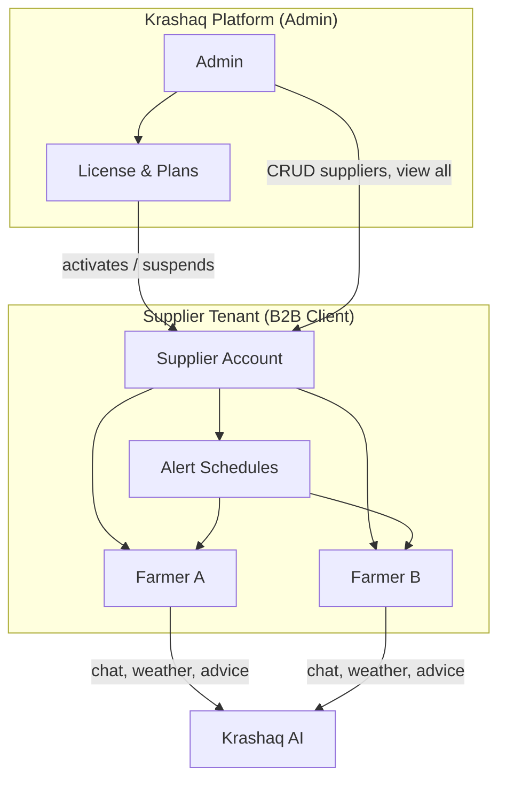

# Krashaq Platform Plan — Admin · Licensed Suppliers · Farmers

> Version 1.0 · Aug 2026  
> Purpose: Align product architecture with your business model and plan completion of admin dashboard, supplier licensing/onboarding, farmer control, and supplier-scoped alerts.

---

## 1. Business model (what you described)

Krashaq is a **B2B2C agritech SaaS**:

| Actor        | Who they are                                      | Relationship                                              | Primary job in the app                                                                              |
| ------------ | ------------------------------------------------- | --------------------------------------------------------- | --------------------------------------------------------------------------------------------------- |
| **Admin**    | You (Krashaq / tool owner)                        | Owns the platform                                         | Issue licenses, onboard/suspend suppliers, see platform-wide analytics, configure global AI & infra |
| **Supplier** | Your **client** (agro dealer, FPO, input company) | Purchases a **license** to use Krashaq for their business | Manage **their** farmers, schedule alerts, view farmer activity — cannot see other suppliers’ data  |
| **Farmer**   | End user on the ground                            | **Bound to exactly one supplier** via `supplier_id`       | Dashboard, chat, weather — experiences Krashaq through their supplier’s license                     |



**Key rules**

1. **Every farmer belongs to one supplier** — admin can reassign; supplier can only CRUD own farmers.
2. **Supplier onboarding = license issuance** — no license → supplier cannot log in or is read-only/suspended.
3. **Alerts are supplier-scoped** — supplier schedules weather/crop/reminder messages for all farmers or per farmer; admin does not schedule farmer alerts (admin schedules platform jobs only).
4. **Admin never “manages farmers” day-to-day** — admin manages **suppliers**; suppliers manage farmers.

---

## 2. Current web application map

### 2.1 Pages by role (what exists today)

| Route                                         | Admin            | Supplier             | Farmer               | Status                                                            |
| --------------------------------------------- | ---------------- | -------------------- | -------------------- | ----------------------------------------------------------------- |
| `/` Dashboard                                 | ✅ Role stats    | ✅ Farmer count card | ✅ Welcome + weather | Partial — supplier dashboard thin                                 |
| `/chat`                                       | ✅               | ✅                   | ✅                   | **Complete** (sessions, stream, agent, RAG)                       |
| `/farmers`                                    | ✅ All farmers   | ✅ Own farmers only  | ❌ Blocked           | Partial — list/create/delete; no edit UI, no assign UI            |
| `/profile`                                    | ✅               | ✅                   | ✅                   | Complete                                                          |
| `/profile/settings`                           | ✅ MFA, password | ✅                   | ✅                   | Complete                                                          |
| `/admin`                                      | ✅               | ❌                   | ❌                   | **Stub** — hardcoded “0 users”, no live stats                     |
| `/admin/users`                                | ✅               | ❌                   | ❌                   | Partial — mixed user list (not supplier-focused)                  |
| `/admin/analytics`                            | ✅               | ❌                   | ❌                   | Partial — LangSmith KPIs + runs table                             |
| `/admin/health`                               | ✅               | ❌                   | ❌                   | Partial — health API works                                        |
| `/admin/config`                               | ✅               | ❌                   | ❌                   | **Broken UI** — form fields ≠ API shape                           |
| `/admin/audit`                                | ✅               | ❌                   | ❌                   | **Stub** — empty `{ items: [] }`                                  |
| `/admin/scheduler`                            | ✅               | ❌                   | ❌                   | **Stub** — empty configs; wrong owner (should be supplier alerts) |
| **Missing** `/admin/suppliers`                | —                | —                    | —                    | **Not built**                                                     |
| **Missing** `/supplier` or `/supplier/alerts` | —                | —                    | —                    | **Not built**                                                     |
| **Missing** `/supplier/farmers/[id]`          | —                | —                    | —                    | **Not built**                                                     |

### 2.2 Navigation (today)

| Nav item                                 | Admin | Supplier | Farmer |
| ---------------------------------------- | ----- | -------- | ------ |
| Dashboard                                | ✅    | ✅       | ✅     |
| Chat                                     | ✅    | ✅       | ✅     |
| Farmers                                  | ✅    | ✅       | ❌     |
| Profile / Settings                       | ✅    | ✅       | ✅     |
| Admin hub                                | ✅    | ❌       | ❌     |
| **Supplier hub** (alerts, license, team) | ❌    | ❌       | ❌     |

### 2.3 API inventory

#### Working (native monolith)

| API                                        | Scope            | Notes                                       |
| ------------------------------------------ | ---------------- | ------------------------------------------- |
| Auth (login, refresh, MFA, me, password)   | All              | ✅                                          |
| `GET/POST /api/farmers`                    | Admin + Supplier | Supplier scoped by `supplier_id`            |
| `GET/PATCH/DELETE /api/farmers/[id]`       | Admin + Supplier | Scoped                                      |
| `POST /api/farmers/[id]/assign`            | Admin            | Assign farmer → supplier                    |
| `GET /api/suppliers`                       | Admin only       | List + farmer counts — **no UI page**       |
| `GET /api/suppliers/me/farmers`            | Supplier         | Used on home dashboard                      |
| Chat, messages, weather, locations         | All (RBAC)       | ✅                                          |
| `GET /api/admin/dashboard`                 | Admin            | Real stats — **not wired to `/admin` page** |
| `GET /api/admin/users` (+ ban, role, etc.) | Admin            | Works — treats suppliers as generic “users” |
| `GET /api/admin/analytics/llm`             | Admin            | ✅                                          |

#### Stub / missing

| API                                | Gap                                                          |
| ---------------------------------- | ------------------------------------------------------------ |
| `POST /api/suppliers`              | No supplier **create/onboard**                               |
| `PATCH /api/suppliers/[id]`        | No license/suspend/update                                    |
| `POST /api/suppliers/[id]/suspend` | Uses generic user ban, not supplier semantics                |
| `GET/POST /api/supplier/alerts`    | **Does not exist**                                           |
| `GET/POST /api/admin/licenses`     | **Does not exist**                                           |
| `GET /api/admin/audit-logs`        | Returns empty stub                                           |
| `GET /api/admin/scheduler/configs` | Returns `{ configs: [] }` — platform cron, not farmer alerts |
| License enforcement on login       | **Not implemented**                                          |

### 2.4 Data model (MongoDB today)

**Collection: `users`** (single collection for all roles)

| Field                                   | Admin   | Supplier   | Farmer                               |
| --------------------------------------- | ------- | ---------- | ------------------------------------ |
| `_id`, `email`, `name`, `password_hash` | ✅      | ✅         | ✅ (farmers may be phone-only later) |
| `role`                                  | `admin` | `supplier` | `farmer`                             |
| `supplier_id`                           | null    | null       | **FK → supplier `_id`**              |
| `is_active`                             | ✅      | ✅         | ✅ (ban/suspend)                     |
| `location`, `language`                  | ✅      | ✅         | ✅                                   |
| **Missing** `license_*` fields          | —       | —          | —                                    |

**Missing collections (needed for your model)**

| Collection          | Purpose                                                       |
| ------------------- | ------------------------------------------------------------- |
| `supplier_licenses` | Plan, seats (max farmers), valid_from/to, status              |
| `farmer_alerts`     | Supplier-defined schedules (cron + template + target farmers) |
| `alert_runs`        | Delivery log (SMS/WhatsApp/email/in-app)                      |
| `audit_logs`        | Admin actions (supplier onboard, suspend, license change)     |

---

## 3. Why the admin dashboard feels incomplete

| Problem                                       | Root cause                                                                         |
| --------------------------------------------- | ---------------------------------------------------------------------------------- |
| Admin home shows **“Total Users: 0”**         | `AdminDashboard.tsx` uses hardcoded stats; ignores `/api/admin/dashboard`          |
| No **Suppliers** section                      | Only generic `/admin/users` — no license, plan, farmer quota, suspend reason       |
| **Scheduler** in admin nav                    | Copied from legacy Python “platform cron” — not your supplier→farmer alert product |
| Config / audit **empty or mismatched**        | APIs stubbed or UI expects old Python shape                                        |
| Suppliers mixed with farmers in one user list | Wrong mental model for B2B onboarding                                              |

**What admin dashboard should show (target)**

1. **Platform KPIs** — suppliers (active/suspended), licensed seats used, farmers total, chat volume, LLM cost
2. **Supplier management** — onboard, edit, suspend, renew license, view farmer count
3. **Platform ops** — health, LangSmith, global config (Groq, SMTP, weather key)
4. **Audit trail** — who created/suspended which supplier and when
5. **Not** farmer day-to-day management (that’s supplier’s job)

---

## 4. Target feature set by role

### 4.1 Admin (tool owner)

| Feature                | Description                                                                             | Priority |
| ---------------------- | --------------------------------------------------------------------------------------- | -------- |
| **Supplier CRUD**      | Create supplier account + send welcome email                                            | P0       |
| **License management** | Plan tier, max farmers, expiry, activate/suspend                                        | P0       |
| **Supplier suspend**   | Block login + optionally freeze their farmers’ access                                   | P0       |
| **Supplier detail**    | Farmers count, last active, license status, usage                                       | P0       |
| **Reassign farmer**    | Move farmer between suppliers (admin only)                                              | P1       |
| **Platform analytics** | Users, chat, LLM (existing + wire to UI)                                                | P0       |
| **Audit logs**         | All admin + supplier lifecycle events                                                   | P1       |
| **Global config**      | LLM, email, weather (fix Config panel)                                                  | P1       |
| **Platform cron**      | KB ingest, session cleanup (keep under `/admin/system`, not mixed with supplier alerts) | P2       |

### 4.2 Supplier (licensed client)

| Feature                                          | Description                                         | Priority |
| ------------------------------------------------ | --------------------------------------------------- | -------- |
| **Supplier dashboard**                           | My farmers, active alerts, license expiry warning   | P0       |
| **Farmer CRUD**                                  | Add/edit/remove farmers (within license seat limit) | P0       |
| **Farmer detail**                                | Profile, location, chat history summary             | P1       |
| **Alert schedules**                              | Weather / irrigation / custom message on cron       | P0       |
| **Per-farmer or all-farmers**                    | Target one farmer or whole roster                   | P0       |
| **Delivery channels**                            | In-app → SMS/WhatsApp/email (phase by channel)      | P1–P2    |
| **License read-only view**                       | Plan name, seats used/max, renew contact            | P1       |
| **Cannot** see other suppliers or platform admin | Enforced by RBAC                                    | P0       |

### 4.3 Farmer (end user)

| Feature                                        | Description             | Priority                  |
| ---------------------------------------------- | ----------------------- | ------------------------- |
| Dashboard, chat, weather                       | Existing                | ✅                        |
| See linked supplier name                       | Profile                 | P1                        |
| Receive scheduled alerts                       | From supplier schedules | P0 (with supplier alerts) |
| **Cannot** access `/farmers` or supplier tools | Existing RoleGuard      | ✅                        |

---

## 5. Proposed data model (additions)

### 5.1 Supplier user document (`users` where `role: supplier`)

```typescript
{
  _id: string;
  email: string;
  name: string;
  role: 'supplier';
  is_active: boolean;           // false = suspended
  suspension_reason?: string;
  suspended_at?: Date;
  suspended_by?: string;        // admin user id
  company_name?: string;
  phone?: string;
  created_at: Date;
  onboarded_by?: string;        // admin id
}
```

### 5.2 `supplier_licenses`

```typescript
{
  _id: string;
  supplier_id: string;
  plan: 'starter' | 'growth' | 'enterprise';
  max_farmers: number; // seat cap
  status: 'active' | 'expired' | 'suspended' | 'trial';
  valid_from: Date;
  valid_until: Date;
  features: {
    alerts: boolean;
    whatsapp: boolean;
    advanced_analytics: boolean;
  }
  created_at: Date;
  updated_by: string; // admin id
}
```

### 5.3 `farmer_alerts` (supplier-owned)

```typescript
{
  _id: string;
  supplier_id: string;
  name: string;                   // e.g. "Morning weather Bhopal"
  alert_type: 'weather' | 'irrigation' | 'custom' | 'scheme';
  schedule: {
    frequency: 'daily' | 'weekly' | 'cron';
    hour: number;
    minute: number;
    timezone: 'Asia/Kolkata';
    cron?: string;
  };
  target: {
    mode: 'all_farmers' | 'selected';
    farmer_ids?: string[];
  };
  template: string;               // message template with {{name}}, {{temp}}
  channel: 'in_app' | 'sms' | 'whatsapp' | 'email';
  enabled: boolean;
  last_run_at?: Date;
  next_run_at?: Date;
}
```

### 5.4 Enforcement hooks

| Hook                | Behavior                                                                |
| ------------------- | ----------------------------------------------------------------------- |
| Login               | Reject supplier if `is_active === false` or license `status !== active` |
| `POST /api/farmers` | Reject if `farmer_count >= license.max_farmers`                         |
| All supplier APIs   | Filter by `auth.user.id === supplier_id`                                |
| Farmer login        | Optional: block if supplier suspended                                   |

---

## 6. UI structure (target routes)

```
/admin                          → Platform KPIs + quick links
/admin/suppliers                → Supplier list (license, status, farmers)
/admin/suppliers/new            → Onboard supplier + issue license
/admin/suppliers/[id]           → Detail, suspend, renew, farmer list
/admin/analytics                → (existing) platform + LLM
/admin/system/health            → (move from /admin/health)
/admin/system/config            → Global env-backed config
/admin/system/jobs              → Platform cron (KB ingest, cleanup) — rename from scheduler

/supplier                       → Supplier dashboard (replaces thin home cards)
/supplier/farmers               → Same as /farmers or redirect
/supplier/farmers/[id]          → Farmer detail + alert subscriptions
/supplier/alerts                → List alert schedules
/supplier/alerts/new            → Create schedule
/supplier/license               → Read-only license & usage

/                               → Farmer/supplier/admin home (RoleDashboard enhanced)
/chat, /profile, /profile/settings → unchanged
```

**Nav change**

| Role     | Sidebar                                            |
| -------- | -------------------------------------------------- |
| Admin    | Dashboard · Chat · **Suppliers** · Admin · Profile |
| Supplier | Dashboard · Chat · Farmers · **Alerts** · Profile  |
| Farmer   | Dashboard · Chat · Profile                         |

Remove **Farmers** from admin default nav (admin reaches farmers via supplier detail).

---

## 7. Implementation phases

### Phase S1 — Admin supplier hub (1.5–2 weeks) **P0**

**Goal:** Admin can onboard, view, suspend, and license suppliers.

| #    | Task                                                                  | Backend                               | Frontend                 |
| ---- | --------------------------------------------------------------------- | ------------------------------------- | ------------------------ |
| S1.1 | Wire admin home to `/api/admin/dashboard`                             | —                                     | `AdminDashboard.tsx`     |
| S1.2 | `supplier_licenses` collection + service                              | `supplier-license-service.ts`         | —                        |
| S1.3 | `POST /api/admin/suppliers` onboard                                   | Create user + license + welcome email | `/admin/suppliers/new`   |
| S1.4 | `GET/PATCH /api/admin/suppliers/[id]`                                 | Update, suspend, renew                | `/admin/suppliers/[id]`  |
| S1.5 | `GET /api/admin/suppliers` list with license + farmer count           | Extend `listSuppliersWithCounts`      | `/admin/suppliers` table |
| S1.6 | Login gate: inactive supplier / expired license                       | `auth-service.ts`                     | Toast on login           |
| S1.7 | Split `/admin/users` → farmers/admins only; suppliers get own section | RBAC                                  | Nav update               |

**Acceptance**

- [ ] Admin creates supplier with 50-farmer license
- [ ] Supplier receives email and can log in
- [ ] Admin suspends supplier → supplier cannot log in
- [ ] Admin dashboard shows live supplier/farmer counts

---

### Phase S2 — Supplier dashboard & farmer management (1 week) **P0**

| #    | Task                                       | Notes                                 |
| ---- | ------------------------------------------ | ------------------------------------- |
| S2.1 | `/supplier` dashboard page                 | Stats: farmers, alerts, license usage |
| S2.2 | Farmer edit UI + `PATCH /api/farmers/[id]` | Name, location, phone                 |
| S2.3 | Seat limit enforcement on create           | 403 when over `max_farmers`           |
| S2.4 | Admin farmer assign UI on supplier detail  | Uses existing assign API              |
| S2.5 | `/supplier/license` read-only view         | Expiry warning banner on dashboard    |
| S2.6 | Enhance `RoleDashboard` + nav for supplier | Alerts link                           |

**Acceptance**

- [ ] Supplier adds farmer until seat cap, then blocked with clear message
- [ ] Supplier edits farmer profile
- [ ] Admin reassigns farmer between suppliers from admin UI

---

### Phase S3 — Supplier alert schedules (1.5–2 weeks) **P0**

**Goal:** Supplier schedules alerts for own farmers (all or selected).

| #    | Task                                                 | Notes                                                              |
| ---- | ---------------------------------------------------- | ------------------------------------------------------------------ |
| S3.1 | `farmer_alerts` + `alert_runs` collections           | —                                                                  |
| S3.2 | CRUD `/api/supplier/alerts`                          | Supplier-scoped RBAC                                               |
| S3.3 | Alert runner                                         | Vercel Cron or `node-cron` worker: `POST /api/internal/run-alerts` |
| S3.4 | Weather alert type                                   | Pull farmer location → weather API → template                      |
| S3.5 | Custom message type                                  | Static template                                                    |
| S3.6 | UI `/supplier/alerts`                                | List, enable/disable, create wizard                                |
| S3.7 | In-app delivery v1                                   | Store in `notifications` or chat system message                    |
| S3.8 | Move admin `/admin/scheduler` → `/admin/system/jobs` | Separate platform vs supplier alerts                               |

**Acceptance**

- [ ] Supplier creates daily 7 AM weather alert for all farmers
- [ ] Supplier creates custom alert for one farmer
- [ ] Farmer sees notification / message next login
- [ ] Admin scheduler page no longer confused with supplier alerts

---

### Phase S4 — Admin polish & audit (1 week) **P1**

| #    | Task                                                |
| ---- | --------------------------------------------------- |
| S4.1 | Real `audit_logs` on supplier lifecycle events      |
| S4.2 | Fix Config panel ↔ `/api/admin/config` schema       |
| S4.3 | Supplier analytics for admin (usage per client)     |
| S4.4 | Email: license expiry reminders to admin + supplier |

---

### Phase S5 — Delivery channels (2+ weeks) **P2**

| Channel  | Dependency                                   |
| -------- | -------------------------------------------- |
| SMS      | MSG91 / Twilio                               |
| WhatsApp | Twilio WhatsApp (legacy Python webhook port) |
| Email    | Existing Nodemailer                          |

---

## 8. What NOT to build in admin (clarification)

| Current `/admin/scheduler`           | Should become                           |
| ------------------------------------ | --------------------------------------- |
| “Message scheduling” for farmers     | **Supplier `/supplier/alerts`**         |
| Platform KB ingest / session cleanup | **`/admin/system/jobs`** (internal ops) |

Admin **does not** schedule farmer weather alerts — **suppliers do**, scoped to farmers where `farmer.supplier_id === supplier.id`.

---

## 9. Current vs target — summary table

| Capability                | Current                            | Target                            |
| ------------------------- | ---------------------------------- | --------------------------------- |
| Business model in code    | Partial (`supplier_id` on farmers) | Full license + tenant isolation   |
| Admin supplier onboarding | ❌ Manual DB / seed only           | UI + API + email                  |
| Admin supplier suspend    | Generic user ban                   | Supplier suspend + license status |
| Supplier license / seats  | ❌                                 | `supplier_licenses` + enforce     |
| Supplier dashboard        | 2 cards on home                    | Dedicated `/supplier` hub         |
| Farmer CRUD               | Create/delete only                 | Full CRUD + detail page           |
| Supplier alerts           | ❌                                 | `farmer_alerts` + cron runner     |
| Admin dashboard stats     | Hardcoded 0                        | Live from API                     |
| Audit                     | Empty stub                         | Supplier lifecycle logged         |

---

## 10. Recommended build order

```
S1 Admin supplier hub (license + onboard + suspend)
    ↓
S2 Supplier dashboard + farmer CRUD + seat limits
    ↓
S3 Supplier alert schedules (in-app first)
    ↓
S4 Admin audit + config polish
    ↓
S5 SMS / WhatsApp delivery
```

**First sprint (highest impact):** S1.1 + S1.2 + S1.3 + S1.5 + S1.6 — admin can license and onboard suppliers; dashboard shows real numbers.

---

## 11. Files to create/modify (cheat sheet)

| New                                               | Modify                                     |
| ------------------------------------------------- | ------------------------------------------ |
| `docs/SUPPLIER-PLATFORM-PLAN.md` (this file)      | `AdminDashboard.tsx` — wire stats          |
| `lib/server/services/supplier-license-service.ts` | `auth-service.ts` — license check on login |
| `lib/server/services/farmer-alerts-service.ts`    | `main-nav.ts` — role-specific nav          |
| `app/api/admin/suppliers/route.ts`                | `RoleDashboard.tsx` — supplier hub links   |
| `app/api/admin/suppliers/[id]/route.ts`           | `farmers-service.ts` — seat limit          |
| `app/api/supplier/alerts/route.ts`                | Remove misleading admin “scheduler” copy   |
| `app/admin/suppliers/page.tsx`                    |                                            |
| `app/supplier/page.tsx`                           |                                            |
| `app/supplier/alerts/page.tsx`                    |                                            |

---

## 12. Open decisions (confirm before S1)

1. **License plans** — fixed tiers (Starter 25 / Growth 100 / Enterprise unlimited) or custom per supplier?
2. **Farmer accounts** — phone-only farmers without email login, or always full user account?
3. **Suspension cascade** — when supplier suspended, do farmers lose chat access or read-only?
4. **Alert channel v1** — in-app only first, or SMS from day one?
5. **Billing** — license tracking only for now, or integrate payment (Razorpay) later?

---

_This plan focuses on the Next.js monolith at repo root (`src/`). It does not require the legacy Python backend._
