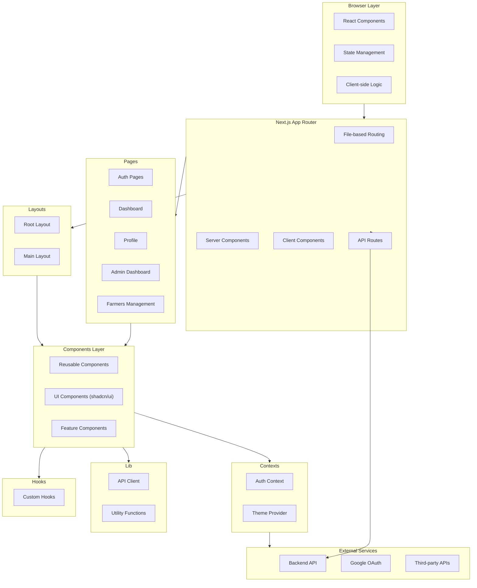
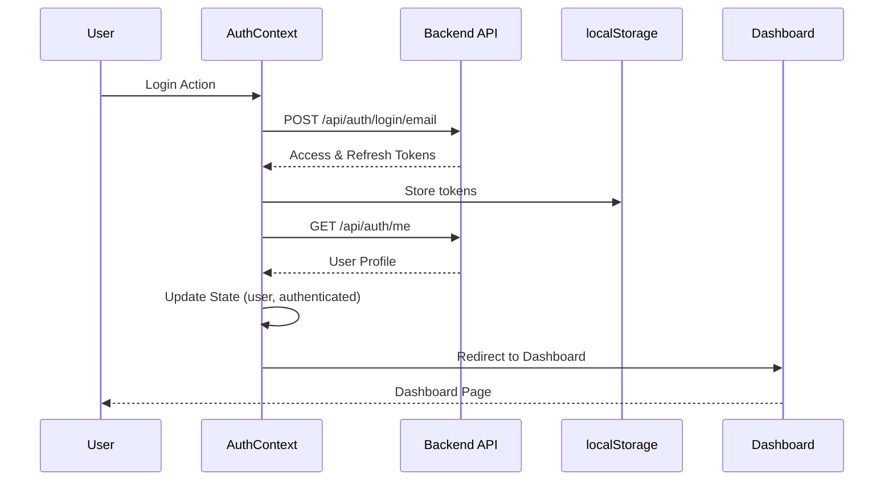
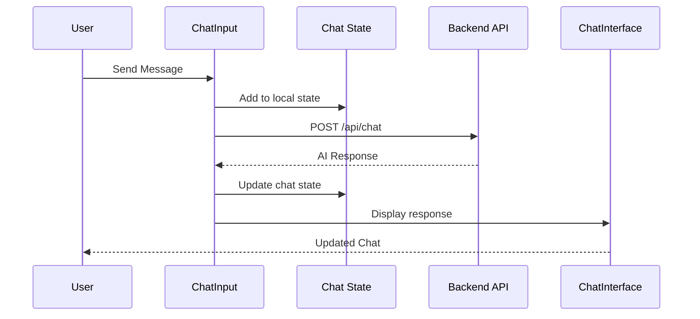
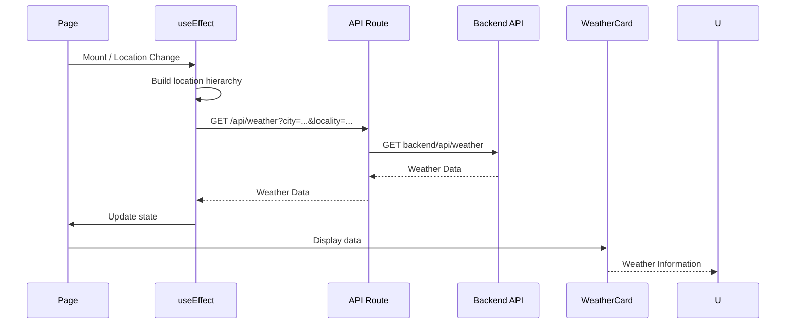

# Krashaq Frontend Architecture Documentation

## System Architecture Overview

Krashaq Frontend is built on Next.js 16 with the App Router, following modern React patterns and best practices. The application uses a component-based architecture with client-side state management and server-side rendering capabilities.



## Architectural Patterns

### 1. Component-Based Architecture

The application follows a component-based architecture where the UI is broken down into small, reusable components:

**Atomic Design Principles**:

- Atoms: Basic UI elements (Button, Input)
- Molecules: Combinations of atoms (FormField, Card)
- Organisms: Complex components (ChatInterface, WeatherCard)
- Templates: Page layouts
- Pages: Complete routes

**Component Hierarchy**:

```
App (Root)
├── Layouts
│   ├── RootLayout
│   └── MainLayout
├── Pages
│   ├── Auth Pages
│   ├── Dashboard
│   ├── Farmers
│   └── Profile
└── Components
    ├── UI Components (shadcn/ui)
    ├── Feature Components
    └── Layout Components
```

### 2. Client-Server Component Pattern

Next.js 16 App Router distinguishes between:

**Server Components** (Default):

- Render on the server
- No client-side JavaScript
- Direct database access
- Better SEO

**Client Components** (use client directive):

- Render on the client
- Interactive features
- State management
- Event handlers

**Usage Strategy**:

- Server components for static content
- Client components for interactive features
- Server actions for mutations

### 3. Context API Pattern

Global state is managed using React Context:

**AuthContext**:

- User authentication state
- Token management
- Login/logout functions
- Protected route logic

**ThemeProvider**:

- Theme state (light/dark/system)
- Theme persistence
- Theme toggle functionality

### 4. File-Based Routing

Next.js App Router uses file-based routing:

```
app/
├── layout.tsx          # Root layout
├── page.tsx            # Home page (/)
├── auth/
│   ├── login/
│   │   └── page.tsx    # /auth/login
│   └── signup/
│       └── page.tsx    # /auth/signup
└── farmers/
    └── page.tsx        # /farmers
```

### 5. API Routes Pattern

Server-side API routes for backend proxy:

```
app/api/
├── chat/
│   └── route.ts        # POST /api/chat
└── weather/
    └── route.ts        # GET /api/weather
```

**Benefits**:

- Hide backend URL
- Add authentication
- Implement caching
- Add logging

## Component Architecture

### 1. Root Layout (`app/layout.tsx`)

**Purpose**: Application root wrapper

**Responsibilities**:

- Global providers setup
- Theme configuration
- HTML structure
- Metadata configuration

**Providers**:

- `ThemeProvider`: Theme management
- `AuthProvider`: Authentication state

**Design Decisions**:

- Server component by default
- Providers wrap children
- Hydration warning suppression

### 2. Main Layout (`components/layout/MainLayout`)

**Purpose**: Main application layout wrapper

**Responsibilities**:

- Header/navigation
- Sidebar (if applicable)
- Main content area
- Responsive design

**Components Used**:

- Header
- Sidebar (future)
- Main content area

### 3. Page Components

#### Home Page (`app/page.tsx`)

- Client component
- Dashboard view
- Weather + Chat integration
- Location-based features

#### Auth Pages

- Login page
- Signup page
- Register page
- Callback page

#### Protected Routes

- `/` - Dashboard (home)
- `/farmers` - Farmers management
- `/admin` - Admin dashboard (admin only)
- `/admin/analytics` - Analytics dashboard (admin only)
- `/admin/audit` - Audit logs (admin only)
- `/admin/config` - System configuration (admin only)
- `/admin/health` - System health (admin only)
- `/admin/scheduler` - Scheduler configuration (admin only)
- `/admin/users` - User management (admin only)
- `/profile` - User profile
- `/profile/settings` - User settings

#### Admin Pages

- Admin dashboard with analytics
- User management
- Audit log viewer
- System configuration
- Scheduler configuration
- System health monitoring

#### Farmers Page

- Farmer management
- CRUD operations
- List view

#### Profile Pages

- User profile
- Settings

### 4. Feature Components

#### Chat Components

- `ChatInterface`: Main chat UI
- `ChatMessage`: Individual message
- `ChatInput`: Input field

#### Dashboard Components

- `WeatherCard`: Weather display
- `IrrigationPanel`: Irrigation advice

#### Admin Components

- `AdminDashboard`: Main admin dashboard
- `AnalyticsDashboard`: Analytics and metrics
- `AuditLogView`: Audit log viewer
- `ConfigPanel`: System configuration panel
- `SchedulerConfigPanel`: Scheduler job configuration
- `SystemHealth`: System health monitoring
- `UserList`: User management list

#### Auth Components

- `ProtectedRoute`: Authentication wrapper
- `AuthForm`: Generic auth form

### 5. UI Components (shadcn/ui)

Reusable UI components based on shadcn/ui:

- Button
- Input
- Card
- Dialog
- Form
- Select
- Tabs
- Toast
- And more...

**Design System**:

- Consistent styling
- Accessible
- Customizable
- TypeScript support

## State Management Architecture

### 1. Local State (useState)

Used for component-specific state:

```typescript
const [weather, setWeather] = useState(null);
const [location, setLocation] = useState('Delhi');
```

**Use Cases**:

- Form inputs
- UI toggles
- Temporary data
- Component state

### 2. Context State (useContext)

Used for global application state:

**AuthContext**:

```typescript
const { user, login, logout, loading } = useAuth();
```

**ThemeProvider**:

```typescript
const { theme, setTheme } = useTheme();
```

**Use Cases**:

- User authentication
- Theme management
- Global preferences

### 3. Server State (API Calls)

Data fetched from backend API:

```typescript
const response = await fetch('/api/weather');
const data = await response.json();
```

**Use Cases**:

- Weather data
- User profile
- Chat messages
- Farmer data

### 4. URL State (useSearchParams)

State stored in URL parameters:

```typescript
const searchParams = useSearchParams();
const city = searchParams.get('city');
```

**Use Cases**:

- Search queries
- Filters
- Pagination
- Shareable links

### 5. Future State Management

**Planned**:

- Zustand for complex state
- React Query for server state
- SWR for data fetching
- Form libraries (React Hook Form)

## Data Flow Architecture

### Authentication Flow



### Chat Flow



### Weather Data Flow



## Routing Architecture

### App Router Structure

**File-based Routing**:

- Automatic route generation
- Dynamic routes with `[param]`
- Route groups with `(group)`
- Parallel routes with `@`

**Route Hierarchy**:

```
/                          → app/page.tsx
/auth/login                → app/auth/login/page.tsx
/auth/signup               → app/auth/signup/page.tsx
/auth/callback             → app/auth/callback/page.tsx
/farmers                   → app/farmers/page.tsx
/admin                     → app/admin/page.tsx
/admin/analytics           → app/admin/analytics/page.tsx
/admin/audit               → app/admin/audit/page.tsx
/admin/config              → app/admin/config/page.tsx
/admin/health              → app/admin/health/page.tsx
/admin/scheduler           → app/admin/scheduler/page.tsx
/admin/users               → app/admin/users/page.tsx
/profile                   → app/profile/page.tsx
/profile/settings          → app/profile/settings/page.tsx
```

### Protected Routes

**ProtectedRoute Component**:

```typescript
<ProtectedRoute>
  <Dashboard />
</ProtectedRoute>
```

**Logic**:

- Check authentication status
- Redirect to login if not authenticated
- Show loading state while checking
- Allow access if authenticated

### Navigation

**Programmatic Navigation**:

```typescript
import { useRouter } from 'next/navigation';

const router = useRouter();
router.push('/dashboard');
```

**Link Navigation**:

```typescript
import Link from 'next/link'

<Link href="/dashboard">Dashboard</Link>
```

## API Integration Architecture

### API Client

**Current Approach**:

- Native fetch API
- Manual token injection
- Manual error handling

**Example**:

```typescript
const response = await fetch('/api/chat', {
  method: 'POST',
  headers: {
    'Content-Type': 'application/json',
    Authorization: `Bearer ${token}`,
  },
  body: JSON.stringify({ message }),
});
```

### API Routes

**Purpose**: Server-side proxy to backend

**Benefits**:

- Hide backend URL
- Add authentication
- Implement caching
- Add logging
- CORS handling

**Structure**:

```typescript
// app/api/chat/route.ts
export async function POST(request: Request) {
  const body = await request.json();
  const response = await fetch(`${BACKEND_URL}/api/chat`, {
    method: 'POST',
    headers: {
      'Content-Type': 'application/json',
      Authorization: `Bearer ${token}`,
    },
    body: JSON.stringify(body),
  });
  return response.json();
}
```

### Future Improvements

**Planned**:

- Axios or ky for HTTP client
- Request/response interceptors
- Automatic retry logic
- Request caching
- Error boundary

## Styling Architecture

### TailwindCSS

**Utility-First CSS**:

- Responsive design
- Dark mode support
- Custom theme configuration
- JIT compilation

**Theme Configuration**:

```javascript
// tailwind.config.ts
module.exports = {
  theme: {
    extend: {
      colors: {
        primary: { ... },
        secondary: { ... }
      }
    }
  }
}
```

### shadcn/ui

**Component Library**:

- Copy-paste components
- Fully customizable
- Radix UI primitives
- TailwindCSS styling

**Benefits**:

- No runtime overhead
- Full control
- Type-safe
- Accessible

### Global Styles

**globals.css**:

- CSS variables
- Tailwind directives
- Custom styles
- Dark mode styles

### Styling Strategy

**Component Styling**:

- Tailwind utility classes
- shadcn/ui components
- Custom CSS for specific needs
- Responsive design

**Theme Support**:

- Light mode (default)
- Dark mode
- System preference
- Manual toggle

## Performance Architecture

### Next.js Optimizations

**Automatic Optimizations**:

- Code splitting (automatic)
- Tree shaking
- Image optimization (next/image)
- Font optimization (next/font)
- Static generation

**Performance Features**:

- Server components (reduce JS bundle)
- Streaming (progressive rendering)
- Edge runtime (future)
- ISR (incremental static regeneration)

### Caching Strategy

**Current**:

- Browser cache (static assets)
- CDN cache (Vercel)

**Planned**:

- API response caching
- Service worker caching
- LocalStorage for user data
- SessionStorage for temporary data

### Bundle Optimization

**Current**:

- Automatic code splitting
- Tree shaking
- Dynamic imports

**Planned**:

- Bundle analysis
- Route-based splitting
- Component lazy loading
- Vendor chunking

## Security Architecture

### Client-Side Security

**Current Measures**:

- JWT token storage (localStorage)
- Protected routes
- Token validation
- HTTPS enforcement (production)

**Security Considerations**:

- XSS prevention (React escapes by default)
- CSRF protection (planned)
- Content Security Policy (planned)
- Input validation

### Authentication Security

**JWT Implementation**:

- Access token (short-lived)
- Refresh token (long-lived)
- Token rotation
- Automatic refresh

**OAuth Security**:

- PKCE (planned)
- State parameter (planned)
- Token validation

### Future Security

**Planned**:

- HTTP-only cookies for tokens
- CSRF tokens
- Security headers
- CSP configuration
- Input sanitization library

## Testing Architecture

### Test Types

**Unit Tests** (Implemented):

- Component testing
- Hook testing
- Utility function testing

**Integration Tests** (Planned):

- API route testing
- Context testing
- Component integration

**E2E Tests** (Planned):

- User flows
- Authentication flows
- Critical paths

### Testing Tools

**Implemented**:

- Jest
- React Testing Library
- jest-environment-jsdom
- @types/jest

**Planned**:

- Playwright / Cypress
- MSW (Mock Service Worker)

### Test Configuration

**Jest Setup**:

- Configured with Next.js integration
- jsdom environment for component testing
- @testing-library/jest-dom for custom matchers
- Coverage collection enabled
- Test files in `__tests__/` directory

**Running Tests**:

```bash
npm run test          # Run tests in watch mode
npm run test:ci      # Run tests in CI mode
```

## Accessibility Architecture

### Current Features

**Semantic HTML**:

- Proper heading hierarchy
- Semantic elements
- ARIA labels (partial)

**Keyboard Navigation**:

- Tab order
- Focus management
- Keyboard shortcuts (future)

### Future Improvements

**Planned**:

- WCAG 2.1 AA compliance
- Screen reader testing
- Color contrast validation
- Focus indicators
- Skip links
- Alt text for images

## Responsive Design Architecture

### Breakpoints

**TailwindCSS Breakpoints**:

- `sm`: 640px (mobile landscape)
- `md`: 768px (tablet)
- `lg`: 1024px (desktop)
- `xl`: 1280px (large desktop)

### Mobile-First Approach

**Strategy**:

- Design for mobile first
- Progressive enhancement
- Touch-friendly UI
- Responsive typography

### Responsive Components

**Patterns**:

- Grid layouts
- Flexbox
- Conditional rendering
- Mobile-specific components

## Error Handling Architecture

### Error Boundaries

**Current**: Basic error handling

**Planned**:

- React Error Boundaries
- Global error handler
- Error logging
- User-friendly error messages

### API Error Handling

**Current**:

- Try-catch blocks
- Basic error display

**Planned**:

- Centralized error handling
- Error toast notifications
- Error retry logic
- Error reporting

## Code Quality Architecture

### Linting

**ESLint Configuration**:

- ESLint v9 with flat config
- TypeScript support with @typescript-eslint
- React rules with eslint-plugin-react
- React Hooks rules with eslint-plugin-react-hooks
- Next.js specific rules with @next/eslint-plugin-next
- Prettier integration for formatting checks

**ESLint Rules**:

- `@typescript-eslint/no-explicit-any`: Error (strict type safety)
- `@typescript-eslint/no-unused-vars`: Warn (with underscore pattern)
- `react-hooks/rules-of-hooks`: Error
- `react-hooks/exhaustive-deps`: Warn
- Prettier/prettier: Error

**Running ESLint**:

```bash
npm run lint       # Check for linting errors
npm run lint:fix   # Auto-fix linting errors
```

### Formatting

**Prettier Configuration**:

- Semi-colons enabled
- Single quotes
- Trailing commas (ES5)
- Print width: 100
- Tab width: 2
- Spaces (no tabs)

**Prettier Ignore**:

- node_modules
- .next
- out
- dist
- build
- coverage
- .turbo
- .vercel

**Running Prettier**:

```bash
npm run format      # Check formatting
npm run format:fix  # Fix formatting issues
```

### Type Checking

**TypeScript Configuration**:

- Strict mode enabled
- No implicit any
- Strict null checks
- Strict function types
- Path aliases (@/*)

**Type Safety Improvements**:

- All `any` types replaced with proper interfaces
- Error handling uses `unknown` with type guards
- Proper type definitions for API responses
- Component props fully typed

**Running Type Check**:

```bash
npx tsc --noEmit    # Type check without emitting files
```

### Code Quality Pipeline

**Pre-commit Checks**:

- ESLint (linting)
- Prettier (formatting)
- TypeScript (type checking)
- Jest (testing)

**CI/CD Checks**:

- All pre-commit checks run in CI
- Pipeline fails on any check failure
- Build runs only after all checks pass

## Deployment Architecture

### Development

**Environment**:

- Local development server
- Hot reload
- Fast refresh
- Debug mode

### Production

**Deployment Platforms**:

- Vercel (recommended)
- Netlify
- AWS
- Docker

**Build Process**:

- Next.js build
- Static generation
- API compilation
- Asset optimization

**Environment Variables**:

- `NEXT_PUBLIC_API_URL`: Backend URL
- `NEXT_PUBLIC_GOOGLE_CLIENT_ID`: OAuth client ID

### CI/CD

**Implemented**:

- Automated linting with ESLint
- Automated type checking with TypeScript
- Automated formatting checks with Prettier
- Automated testing with Jest
- Automated builds with Next.js
- Pipeline failure on any check failure

**CI/CD Pipeline Steps**:

1. Install dependencies
2. Run ESLint
3. Run TypeScript type checking
4. Run Prettier formatting check
5. Run Jest tests
6. Build Next.js application

**Planned**:

- Automated deployments
- Rollback capability

## Monitoring Architecture

### Current State

**Basic Monitoring**:

- Console logs
- Error messages
- Performance metrics (basic)

### Planned Monitoring

**Application Monitoring**:

- Error tracking (Sentry)
- Performance monitoring
- User analytics
- A/B testing

**Logging**:

- Structured logging
- Log aggregation
- Error logging
- Performance logging

## Technology Rationale

### Next.js 16 (App Router)

**Reasons**:

- Modern React framework
- Server components
- Built-in optimization
- Great developer experience
- Strong ecosystem
- Vercel integration

### TypeScript

**Reasons**:

- Type safety
- Better IDE support
- Catch errors early
- Self-documenting code
- Better refactoring

### TailwindCSS

**Reasons**:

- Utility-first approach
- Small bundle size
- Customizable
- Dark mode support
- Great DX

### shadcn/ui

**Reasons**:

- No runtime overhead
- Full control
- Type-safe
- Accessible
- Customizable
- Modern design

### React Context API

**Reasons**:

- Built into React
- No extra dependencies
- Simple API
- Good for small state

### Native Fetch

**Reasons**:

- Built into browser
- No extra dependencies
- Modern API
- Good performance

## Future Architectural Improvements

### Short Term

**Immediate**:

- Complete error boundaries
- Add loading states
- Improve error handling
- Add form validation
- Implement toast notifications

**Near Future**:

- Add React Query for server state
- Implement Zustand for complex state
- Add React Hook Form for forms
- Implement MSW for testing
- Add comprehensive testing

### Medium Term

**Planned**:

- Implement PWA features
- Add service worker
- Offline support
- Add analytics
- Implement monitoring
- Add performance optimization

### Long Term

**Future**:

- Micro-frontends (if needed)
- GraphQL integration
- Real-time features (WebSockets)
- Advanced animations
- Mobile app (React Native)

## Documentation Standards

### Code Documentation

**Component Documentation**:

- JSDoc comments
- Prop types (TypeScript)
- Usage examples
- Storybook (planned)

### API Documentation

**API Route Documentation**:

- Endpoint descriptions
- Request/response formats
- Error codes
- Authentication requirements

### Architecture Documentation

**System Documentation**:

- Architecture diagrams
- Component relationships
- Data flow diagrams
- Decision records (ADRs)

## Best Practices

### Component Design

**Guidelines**:

- Single responsibility
- Reusability
- Composition over inheritance
- Props drilling (avoid with context)
- Keep components small

### State Management

**Guidelines**:

- Local state first
- Context for global state
- Server state with React Query
- URL state for shareable state
- Avoid prop drilling

### Performance

**Guidelines**:

- Use server components when possible
- Lazy load heavy components
- Optimize images
- Minimize re-renders
- Use React.memo wisely

### Security

**Guidelines**:

- Validate inputs
- Sanitize outputs
- Use HTTPS
- Protect sensitive data
- Keep dependencies updated

### Accessibility

**Guidelines**:

- Semantic HTML
- ARIA labels
- Keyboard navigation
- Color contrast
- Screen reader support
